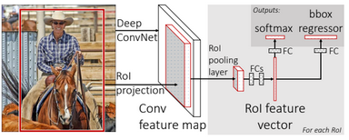

# [Fast R-CNN](https://drive.google.com/file/d/18nDIQ_7Qk7PfVhkwqmZCNsl7Bw1P_umz/view?usp=sharing)

- R-CNN: Region-based Convolutional Network method
- Use SPPnets (Spatial pyramid pooling networks) to speed up R-CNN
    - one forward pass for all proposals (R-CNN needs to run conv-op once for each proposal)
- RoI pooling layer
    - uses max pooling to convert the features inside any valid region of interest into a small feature map with a fixed spatial extent of H × W
    - small feature maps are flattened to RoI feature vector
    - RoI feature vector is sent to bbox and cls FC layer branches
- Smooth L1 loss on bbox regression
    

