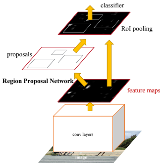

# [Faster R-CNN: Towards Real-Time Object Detection with Region Proposal Networks](https://drive.google.com/file/d/1dXHOciAgu9CdqyZjQLOwJowRIqYWA2_h/view?usp=sharing)

- convolutional feature maps used by region-based detectors, can also be used for generating region proposals.

- Region Proposal Network (RPN) 
    - takes an image (of any size) as input
    - outputs a set of rectangular object proposals, each with an objectness score.
    - This feature is fed into two sibling fully-connected layers
        - a box-regression layer (reg)
        - a box-classification layer (cls).