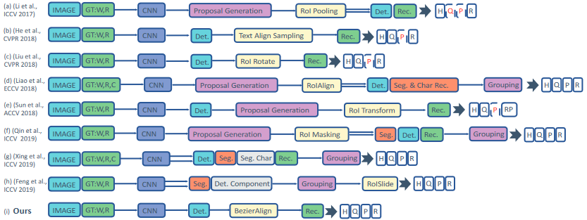

# [ABCNet: Real-time Scene Text Spotting with Adaptive Bezier-Curve Network (CVPR 2020)](https://drive.google.com/file/d/1ZzdfzqJBuSGobJnIeIWl2EJSC-ytynMS/view?usp=drivesdk)

## Overview
- Bezier Curve Detection and BezierAlign + CTC
- single-shot, anchor-free
- 相比之前的论文使用text spotting，本文自适应拟合巴塞尔曲线，仅使用几个控制点（control points）就可以描述文字的复杂排布，减少了计算成本 adaptively fit arbitrarily-shaped text by a parameterized Bezier curve (**BezierAlign layer**)
- ABCNet还精简了pipeline，加快了计算速度
- 高达 22.8 fps
- 支持中英文识别
- 之前的TextAlign和FOTS，默认文字轮廓是直边四边形，可以被认为是ABCNet的特例
- 省去了[2D attention](towards_end-to-end_text_spotting_in_natural_scenes.md) 中的复杂变换
- 对于任意文字排布问题，有两种解决算法：
  - segmentation-based methods：图片分割
  - regression-based methods：预定义文字排布形状，并回归分析形状模型
- 官方的AdelaiDet库需要依赖Facebook的Detectron2，而Detectron2中有个C编译的`_C.cpython-37m-x86_64-linux-gnu.so`只能在Linux中运行，而ABCNet2中将BezierAlign编译到了一个`.cu`文件中，可能也会影响模型跨平台的迁移
  

## Method
- Bezier curve
  - Bezier curve 被描述为 Bernstein Polynomials 作为的基函数的线性组合：  
  - 本方法使用cubic Bezier curve，即复杂度（degree n）为3，4个控制点定义一条线。一个bbox只要8个控制点，即上下各一条巴塞尔曲线。
  - Bernstein Polynomials： 
- 巴塞尔Ground Truth生成
  - CTW1500上下边各7个点，Total-Text上下边各5个点
  - 目的是将普通的基于多边形标注（polygonal annotations，m个点  ）转换为巴塞尔曲线标注
  - 使用least square method拟合巴塞尔曲线
  - 
- BezierAlign
  - 过去的non-segmentation采样方法大多使用长方形采样（RoI Pooling, RoI-Rotate, Text-Align-Sampling）
  - 本文的BezierAlign中，每列的边界与上下曲线边界正交（orthogonal，即垂直），采样点（交点）等距
  - 输出的是长方形feature map，大小 
  - 为了计算每个输出feature map像素在曲线上的对应点，需要算出其在输出feature map相对位置参数t  
  - 根据位置参数t，带入，算出上下延曲线上的位置 tp 和 bp
  - 进而算出原特征空间的采样点  
  - 根据坐标op，使用bilinear interpolation实现插值（映射）
- Recognition branch
  - BezierAlign输出的就是矫正好的图像
  - 识别分支使用LSTM输出文字
  - 最后的loss使用CTC Loss

## References
- [ArXiv](https://arxiv.org/abs/2002.10200)
- [Github (Adelaidet, PyTorch)](https://github.com/aim-uofa/AdelaiDet)
- [Github (Chinese)](https://github.com/Yuliang-Liu/ABCNet_Chinese)
- [加强版ABCNet v2](./abcnet_v2.md)