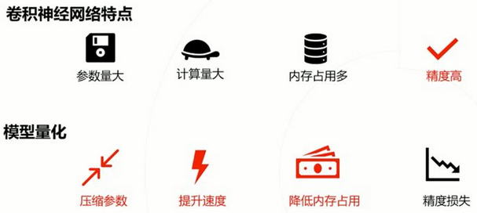

# [ABCNet v2: Adaptive Bezier-Curve Network for Real-time End-to-end Text Spotting (CVPR 2021)](https://drive.google.com/file/d/1ZzdfzqJBuSGobJnIeIWl2EJSC-ytynMS/view?usp=drivesdk)

## Overview
- 高达30~50fps
- 相比会议版的 [ABCNet v1](./ABCNet_real-time_scene_text_spotting_with_adaptive_bezier-curve_network.md)，v2加强了feature extractor，detection branch，recognition branch和end-to-end training
  - 加入了迭代双向特征 incorporates iterative bidirectional features
  - 使用了坐标编码方法 coordinate encoding approach
  - 在识别分支中增加**字符注意力模块** character attention module
  - 提出了自适应端到端训练策略 Adaptive End-to-End Training (AET) strategy

## Method
- Structure
  - Bezier curve detection
  - the coordinate convolution module
  - BezierAlign
  - the light-weight attention recognition module
  - the adaptive end-to-end training strategy
  - text spotting quantization
- **CoordConv**
  - 传统卷积很难学习在直角坐标系下 坐标（coordinate）间的映射，并在one-hot像素空间下定位
  - 为解决此问题，可以将 相对坐标（relative coordinates） 与 像素值 连接（concatenate），即coordinate encoding
  - 该方法直接将坐标信息引入视觉特征的学习，提高了准确率
- BezierAlign 依然沿用v1的方法，计算相对位置参数t，并转换到巴塞尔曲线方程中
- Attention-based Recognition Branch
  - 相比v1中的LSTM直接输出字符预测，v2**取消了CTC loss**，LSTM只提供特征 , 并作为输入值，输入到**注意力识别模块**
  - 注意力机制每次读取
    - 裁剪过的LSTM状态特征向量 
    - 上次的字符预测 （c-category softmax，中英文下，c=5462。英文下c=96）
    - 前一个隐藏状态  
  - 注意力weight根据以下公式计算
    - 注意力权重特征：
    - 归一化的注意力权重：
    - 根据注意力加权后的LSTM特征：
    - 注意力机制自身的状态更新：
    - 根据注意力机制的状态，一层全量网络算出当前（未归一化）预测 
    - 而最终用到的结果是归一化的预测 
- Adaptive End-to-End Training
  - 训练时，为了稳定，直接使用Ground Truth来训练识别分支。但在测试时，cropping的区域不理想，导致结果变差。
  - 为解决此问题，AET使用了一个**置信阈值**（confidence threshold），并使用**NMS**（非极大值抑制 Non-Maximum Suppression）来提出冗余的检测结果
  - 一开始coordinate convolution module检测到的控制点  是被抑制的，ground truth  直接替换检测到的控制点，参与训练
  -  如果rec差太大就用  替换掉检测值
- Text Spotting Quantization（可以理解为模型压缩）
  - 量化text spotting任务，目标是离散化高精度tensor到低比特tensor，而不影响网络性能 

## References
- [ArXiv](https://arxiv.org/abs/2105.03620)
- [Github](https://github.com/Yuliang-Liu/ABCNet_Chinese)