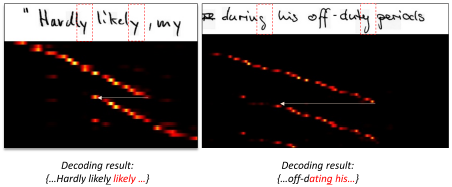
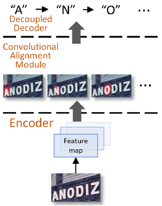
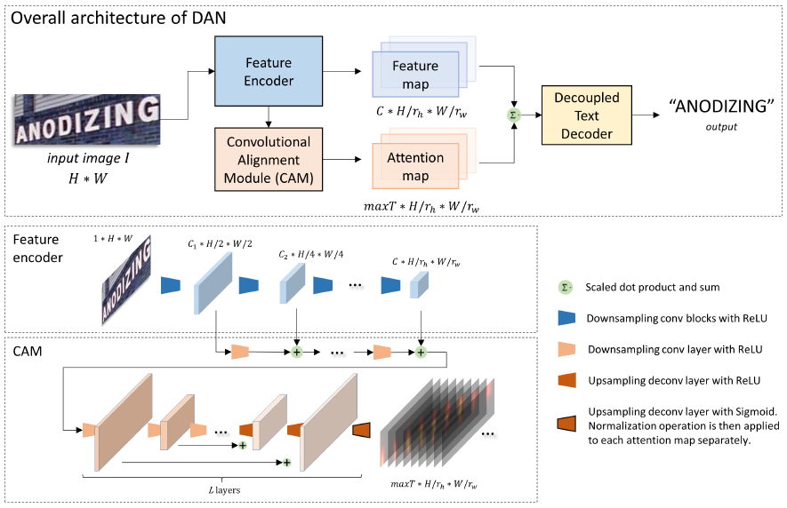
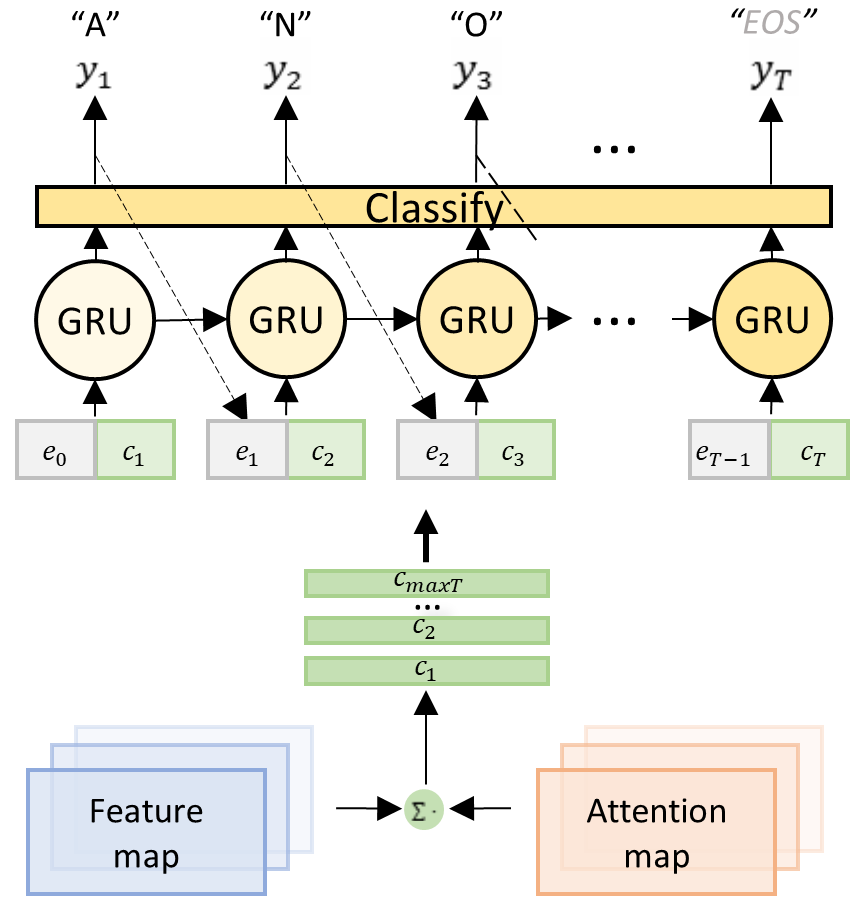

# [Decoupled Attention Network for Text Recognition (DAN, ICCV 2019)](https://drive.google.com/file/d/13DHYBSPXPqXiqv2GYidIOnI2dAgf6ss5/view?usp=drivesdk)

## Overview
- 使用历史解码结果 分离匹配操作
- 使用CAM代替循环匹配模块（recurrency alignment module）

## Method
- 结构
  - feature encoder 获取视觉特征 (使用了减采样)
  - convolutional alignment module (CAM) 将匹配操作从特征编码模块中分离出来
  - decoupled text decoder 分离后的文字解码器（GRU）
- Feature encoder的输出大小为 ，C是输出通道数
- CAM输出 ，maxT是最大通道数，等于 最后要输出的 最大字符串长度

 
 

## References
- [ArXiv](https://arxiv.org/abs/1912.10205)
- [Github (PyTorch)](https://github.com/Wang-Tianwei/Decoupled-attention-network)