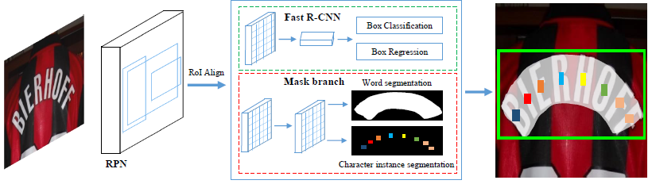

# [Mask textspotter: An end-to-end trainable neural network for spotting text with arbitrary shapes](https://drive.google.com/file/d/1G25wffK557yk5K417wZHyRG7dTAOi8pW/view?usp=drivesdk)

## Overview
- 使用语义分割来实现准确的文字检测和识别
- 生成文字对象的shape mask，之后再检测再2D空间内分割到的文字区域
- **缺点**：
  - 只能处理字母类语言，不适合处理中文
  - 很难处理标点符号（数量过大）
  - 需要字符级的标注，成本太高

## Method
- Framework由4部分组成
  - feature pyramid network (**FPN**) 提取特征
  - region proposal network (**RPN**) 生成text proposals
  - **Fast R-CNN** 生成 bounding boxes regression
  - two mask branches
    - text instance segmentation 生成文字实例分割：
      - 1 global text instance map
    - character segmentation 生成字符分割
      - 36 character maps：26 letters + 10 Arabic numerals
      - 1 background character map
  - 目标变量有：
    - : polygons which represent the localization of text regions
    - ：the category and location of a character

## Dataset
- SynthText
- ICDAR2013
- ICDAR2015
- Total-Text

## References
- [IEEE](https://ieeexplore.ieee.org/document/8812908)
- [Github (PyTorch)](https://github.com/MhLiao/MaskTextSpotter)