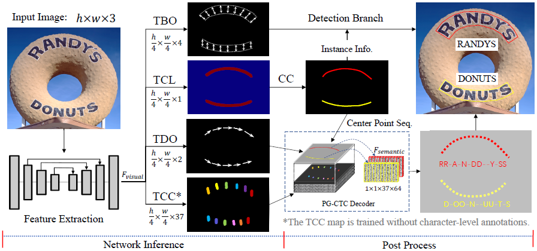
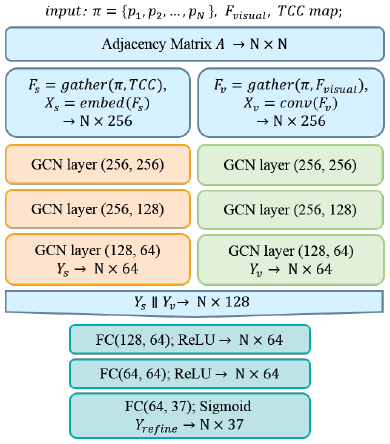
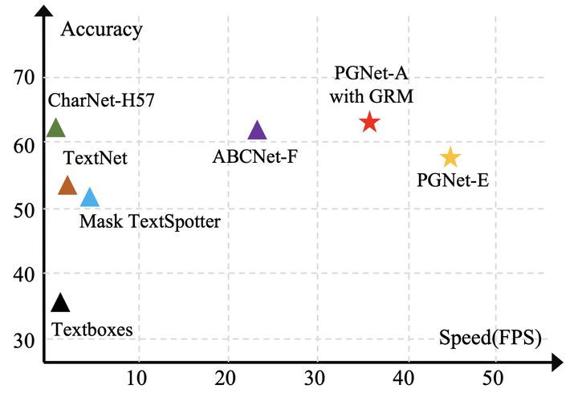
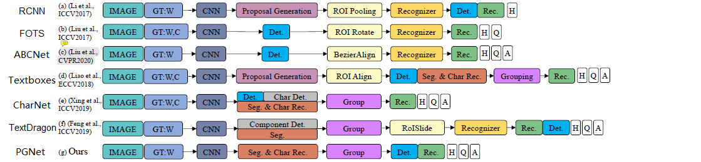

# [PGNet: Real-time Arbitrarily-Shaped Text Spotting with Point Gathering Network (AAAI 2021)]()

## Overview
- Two stage框架或基于字符的方法上，它们受到非极大抑制 (NMS)、RoI 操作或字符级标注的影响
- **全卷积点收集网络** (PGNet)：
  - 实时读取任意形状的文本
  - segmentation型单阶段模型
  - 像素级字符分类图是通过PG-CTC损失学习的，从而避免使用字符级的标注
  - 二维空间中收集高级字符分类向量并将它们解码为文本符号，而无需涉及 NMS 和 RoI 操作
  - 图细化模块（graph refinement module = GRM）来优化粗识别并提高端到端性能
  - 可达 46.7 FPS
- 两种变体
  - PGNet-A = PGNet-Accuracy --> ResNet-50
  - PGNet-E = PGNet-Efficient --> EfficientNet-B0
- 硬件要求
  - Intel(R) Xeon(R) CPU E5-2620; GPU: NVIDIA TITAN Xp x4; RAM: 64GB
  - 目前只支持PaddlePaddle

## Method
- **架构**
  - 直接从FPN (Feature Pyramid Network) 生成的 学习文本区域的各种信息：
    - 四种feature map大小均为原输入图片的1/4，分别由各自的目标标注 (supervised by the same scale label maps) 做训练
      - 文本字符分类图（pixel-level TCC）：对像素做分类，提供字符级别的信息
      - 文本中心线 (TCL)：获取字符中心点序列
      - 文本方向偏移 (TDO)：获取正确阅读顺序
      - 文本边框偏移 (TBO = boundary offset)：通过多边形修复，检测每个字符实例，针对每个点  输出上下边界的offset，由此通过中心点算出多边形边界点。
- **PG-CTC解码器 (point gathering - connectionist temporal classification decoder)**
  - 可以序列化高层2D TCC map生成字符分类概率序列，并解码成最终的文字识别结果
  - **免除 字符级别的标注，NMS和RoI**
  - 文字区域中心点序列  + TCCmap 字符分类概率图 + TCL读取顺序 = 字符概率序列 
  - ，大小为 的概率向量序列
  - 像素级字符分类图使用点收集 CTC (PG-CTC) 损失进行训练，不需要字符级标注。 
    - P 是检测出的字符分类概率序列
    - L 是转录标签 transcript label（**可以通过word-level标签计算出中心线，并采样获取** ）
  - PG-CTC解码器从测得的概率向量序列  算出 中心点  的文字记录（transcription） 
   

- **Graph Refinement Module (GRM)** --> Optional
  - 用来推理文字与其邻居间的关系，以提高正确率
  - 使用图卷积网络（GCN）来实现推理
  - 每个  中的点都作为一个图中的节点。 和 TCC map 被作为节点特征输入，使用**两个独立的GCN进行学习（semantic reasoning graph & visual reasoning graph）**，直到最后采用FC统一处理
  - 关联矩阵（adjacency matrix ）中元素为 中心点  和  间的L2距离 
  - Semantic Reasoning Graph
    - 注意：, 嵌入获得 
  - Visual Reasoning Graph
    - 

## Dataset
- ICDAR 2015
- Total-Text

## Comparison

- 其他算法的缺点
  - TextDragon 和 Mask TextSpotter 强假设文本区域的阅读方向要么是从左到右、要么是从上到下
  - 在实践中免费合成数据并不能完全替代真实数据
  - 在Mask TextSpotter和CharNet中，训练需要字符级的标注，成本太高

## References
- [ArXiv](https://arxiv.org/abs/2104.05458)
- [AAAI](https://ojs.aaai.org/index.php/AAAI/article/view/16383)
- [PGNet (知乎)](https://zhuanlan.zhihu.com/p/385115756)
- [PaperswithCode](https://paperswithcode.com/paper/pgnet-real-time-arbitrarily-shaped-text)