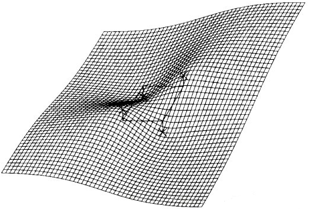
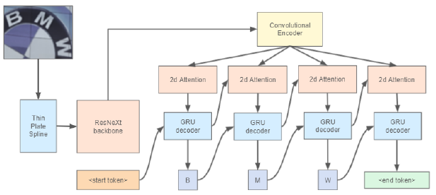

# [Why You Should Try the Real Data for the Scene Text Recognition (Yet Another Text Recognizer， ArXiv 2021)](https://drive.google.com/file/d/1gQoln9gCl_d-QhwuxfZ76pI4GA_Uj-ur/view?usp=drivesdk)

## Overview
- 本文主要是根据以下几篇文章，整合提出一个强模型：
  - What is wrong with scene text recognition model comparisons? (ICCV 2019)
  - [Spatial transformer networks](spatial_transformer_networks.md) (**TPS**, ANIPS 2015)
  - An attentional scene text recognizer with **flexible rectification** (ASTER, TPAMI 2019)
  - **ResNeXt** (Aggregated residual transformations for deep neural networks, CoRR 2016)
  - **text recognition head** (Open images v5 text annotation and yet another mask text spotter 2021)
- 同时提出应当使用足够多的真实数据训练网络
- 缺点：
  - 只能做识别，不能定位大图中的文字

## Method
- **Thin Plate Spline (TPS 薄板样条插值变换)**: 
  - 用于矫正图像，以用于识别
  - 在两张图像中找出N个匹配点，应用TPS可以将这N个点形变到对应位置，同时给出了整个空间的形变(插值)。 
  - Spatial transformer mechanism 含有三个部分：
  - localization network 输入图片，生成参数
  - grid generator 根据预测出来的参数，生成sampling grid
  - sampler根据grid和输入图片，生成输出图片
- **Backbone**
  - ResNeXt-101
- **Text Recognition Head**
  - Convolutional Encoder + Attention + GRU decoder

## Dataset
- [OpenImages V5 dataset](https://storage.googleapis.com/openimages/web/visualizer/index.html?set=train&type=segmentation&r=false&c=%2Fm%2F02d9qx): 数据量接近合成数据库，但是人工标注的真实图片
- ICDAR 2003 (Robust Word Recognition)
- ICDAR 2013 (Robust Word Recognition)
- ICDAR 2015 (Robust Word Recognition)
- SVT (Scene Text Recognition)
- [MJSynth](https://www.robots.ox.ac.uk/~vgg/data/text/)

## References
- [ArXiv](https://arxiv.org/abs/2107.13938)
- [GitHub (PyTorch)](https://github.com/openvinotoolkit/training_extensions)