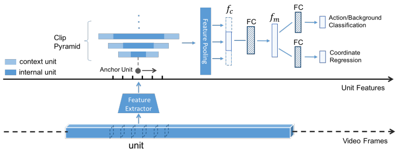

# [TURN TAP: Temporal Unit Regression Network for Temporal Action Proposals](https://drive.google.com/file/d/17lxSPXhJ-opFUcGdbZFkosxIcGwwFv3W/view?usp=drivesdk)

## Overview
- predicts action proposals
- refines the temporal boundaries by temporal coordinate regression
- Fast computation is enabled by unit feature reuse

## Methods

- video units = 16~32 frmaes
- unit-level visual features using off-the-shelf models
  - C3D: optical flow based CNN model
  - RGB image CNN model
- Multiple temporal scales are used to create a clip pyramid (Clip Pyramid Modeling)
  - 使用anchor unit + context对不同temporal resolution提取特征
- Unit-level Temporal Coordinate Regression
  - infer the temporal boundaries
  - two sibling output layers:
    - one for confidence core
    - one for regression offsets (the starting time and ending time of an action in the clip)
- Some properties
  - may not be discriminative enough to regress the coordinates at frame-level (only unit-level)
  - not use coordinate parametrization, but directly use offset
   

## Preview Works
- temporal sliding windows + classification
  - trade-off between density of the sliding windows and computation time
- other temporal action proposals methods
  - **binary classification problem + sliding window**
    - Temporal action localization in untrimmed videos via multi-stage cnns (CVPR 2016)
    - Fast temporal activity proposals for efficient detection of human actions in untrimmed videos (CVPR 2016)
  - **LSTM** -> encode video streams and infer multiple action proposals inside the streams
    - Deep action proposals for action understanding (ECCV 2016)
- Boundary regression
  - Towards real-time object detection with region proposal networks (NIPS 2015)
  
## Metrics
- AR-N curve
- AR-AN curve
- AR-F curve

## Dataset
- ActivityNet
- THUMOS-14

## References
- [code](https://github.com/jiyanggao/TURN-TAP)