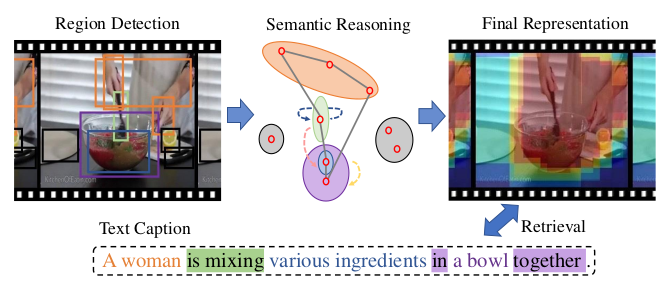
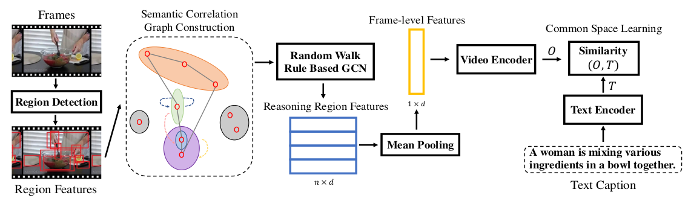

# [Exploiting Visual Semantic Reasoning for Video-Text Retrieval (ViSERN)](https://drive.google.com/file/d/1Ax9_-cdDv-eNBPu3cJ6gzQcLW3V41Qz5/view?usp=drivesdk)

## Keywords
- Video retrieval
- Video semantic reasoning

## Overview

- videos consist of various and abundant semantic relations 着重于获取视频中语义关联
- Visual Semantic Enhanced Reasoning Network (ViSERN) 基于图神经网络做reasoning
- Reasoning suppresses the impact of redundancy 降低了不同区域间语义互动的冗余
- Goal: measure the similarity between video-text pairs by **common space learning** 通过共同空间学习衡量视频-文本对之间的相似性

## Methods
1. Region Features Extraction 获取视频区域特征，区域特征向量v组成的V
2. frame regions as vertices 图的一个顶点就是一个视频区域向量，G = (V, E) 
3. construct a fully-connected undirected semantic correlation graph to measure semantic relations between regions 构建全连无向语义关联图
4. random walk rule-based graph convolutional networks to generate region features involved with semantic relations 基于随机行走规则的图卷积网络生成涉及语义关系的区域特征
   - 利用了spectral graph analysis中的graph Laplacian操作
   - 将特征x从空间域变换到频域，在频域中计算g后，再变换回空间域
5. the region features are aggregated to form frame-level features for further encoding to measure video-text similarity 将区域特征汇总，形成帧级特征，用于进一步编码，以衡量视频-文本相似度

## Previous Works
- **CNN: extract mid-level features as the representations of frames for further manipulating to calculate similarity scores between videos and texts**
  - Predicting visual features from text for image and
video caption retrieval (TMM 2018)
  - Learning joint embedding with multimodal cues for
cross-modal video-text retrieval (ICMR 2018)

- **encode frame-level features in a multi-level way**
  - Dual encoding for zero-example video retrieval (CVPR 2019)
- **GNN Reasoning**
  - novel random walk (Online learning of social representations [ACM SIGKDD 2014])
    - The neighbor vertices with higher weight are more likely to be visited
  - rule-based Graph Convolutional Networks (GCN 2017)

## Opinions
- observing and reasoning semantic relation evolution (motions, interactions, relative positions and other high-level semantic concepts) between these regions during the timeline
- visual semantic reasoning is fundamental for humans to understand the real world (Bottom-up and top-down attention: different processes and overlapping neural systems [The Neuroscientist 2014])
- previous works fail to **capture high-level semantic interactions** and treat discriminative regions equally
- embedding based methods:
  - encode global, temporal and local pattern information respectively for both video and text ends
  - no study has attempted to incorporate visual semantic reasoning
  - CNN
  - mean pooling, bidirectional GRU, and 1-D CNN
- introduce random walk statistics into GCN to enhance its visual reasoning ability

## Dataset
- Visual Genome (Connecting language and vision using crowdsourced dense image annotations [IJCV 2017])

## References
- 