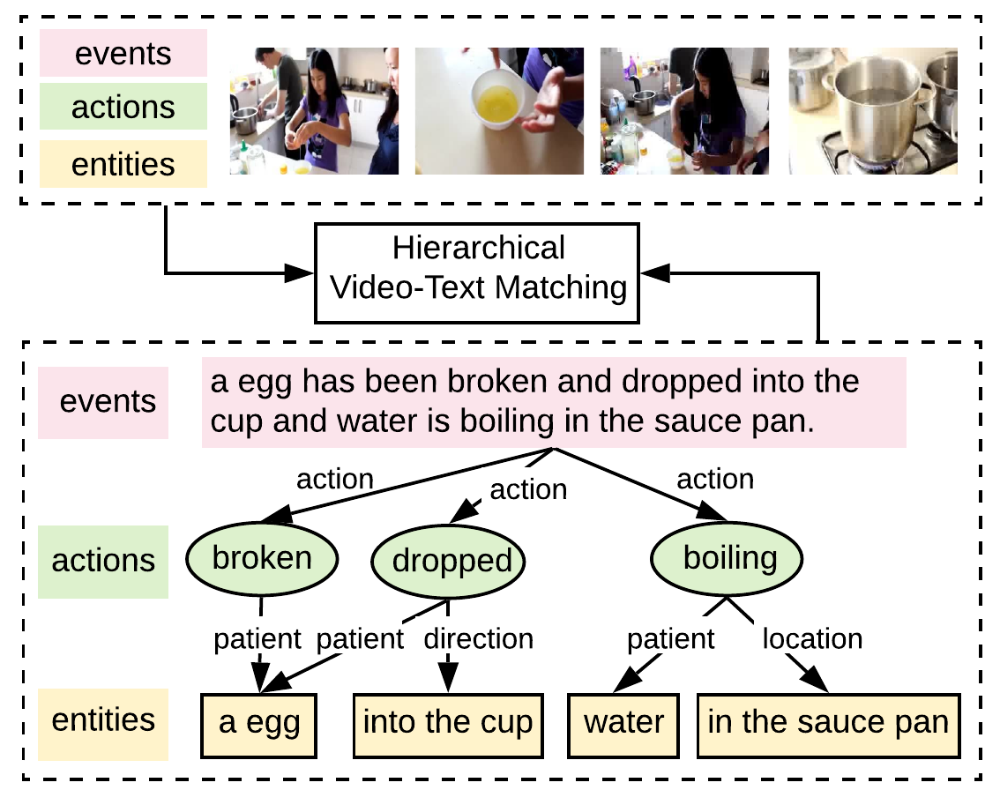
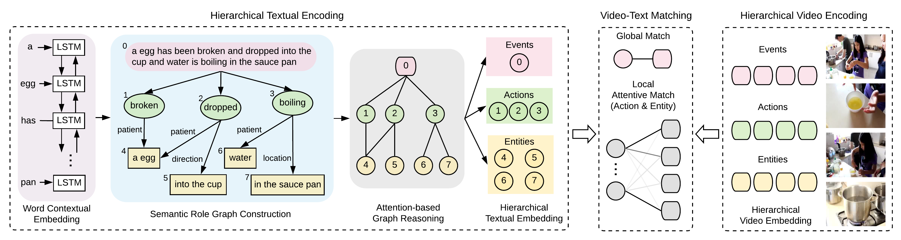

# [Fine-Grained Video-Text Retrieval With Hierarchical Graph Reasoning (CVPR 2020)](https://drive.google.com/file/d/1jlsTvsFQ7VLPko-rcxZlB6cz4pSBzi79/view?usp=drivesdk)

## Authors
- 中国人民大学：Shizhe Chen，Yida Zhao，Qin Jin
- University of Adelaide (Australia): Qi Wu

## Overview

- Cross-modal retrieval between videos and texts，跨模态检索，简单来说就是根据一段描述文字检索出展现出这段文字内容的视频
- **Hierarchical Graph Reasoning** (HGR) model 将一句话看成三个层级，即全局转局部
  - 首先是Events事件，即整句话，描述的是整句话的结构
  - 然后是actions，即事件句中包含的动词，描述的是事件的动作
  - 最后是entities，即事件中做动作的名词短语，描述的是事件的主语，使用这种方法来保留句子的语义信息和关系。

## Method
- Hierarchical Textual Encoding
  - 目的：构建一个三层的语义角色图结构（Semantic Role Graph Structure）
  - 结构：第一层是整句的embedding，最为events层，用来保留语序（主语/宾语次序），第二层放动词，第三层放名词和介词短语
  - 输入：
    - Bi-LSTM生成的句子embedding，作为第一层输入
    - 使用semantic role parsing toolkit获取语句的名词和动词，并重用Bi-LSTM对词做嵌入，作为第二三层的输入
  - 连接与信息传递矩阵：
    - 为了消除歧义（reduce ambiguity），如动作break会导致embedding更接近broken egg而不是round egg has been broken，所以要推理节点间的互动关系
    - 方法1：使用relational GCN，对每个节点学习一个矩阵，但这种方法容易参数爆炸
    - 方法2：将每个节点的多关系矩阵分解（factorize）成两部分，共享的矩阵 和独立的
  - GCN的节点更新方程是  

    - 先让role embedding matrix与主谓宾节点组相乘 
    - 使用注意力机制，让全句中重要的（出现多的）单词作为嵌入  
    - 在乘以共享矩阵 + residual connection 
  
- Hierarchical Video Encoding
  - 对于视频很难做到像处理文字一样学习多层结构，所以转而**关注视频的不同层次**（focus on different level of aspects in the video）
  - 使用不同的变换矩阵，来对每一帧提取event，action，object特征
- Video-Text Matching
  - Global Matching: cosine similarity  
  - Local Attentive Matching:  

## Dataset
- [MSR-VTT (MSR Video to Text)](https://paperswithcode.com/dataset/msr-vtt)
- [TGIF](http://raingo.github.io/TGIF-Release/)
- [VATEX](https://eric-xw.github.io/vatex-website/about.html)

## References
- [CVPR citation](https://openaccess.thecvf.com/content_CVPR_2020/html/Chen_Fine-Grained_Video-Text_Retrieval_With_Hierarchical_Graph_Reasoning_CVPR_2020_paper.html)
- [arXiv](https://arxiv.org/abs/2003.00392)
- [CSDN 论文阅读笔记](https://blog.csdn.net/qq_43310834/article/details/108384293)
- [GitHub code](https://github.com/cshizhe/hgr_v2t)