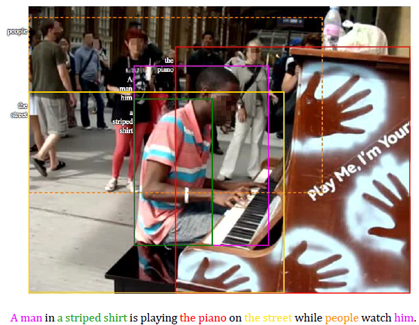
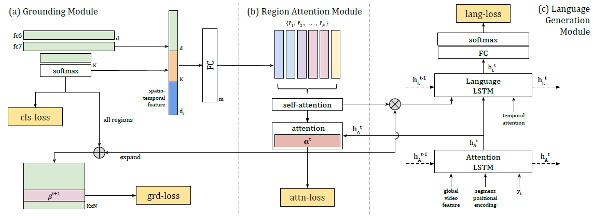

# Grounded Video Description

## Benefits
- collected a large-scale ActivityNet-Entities dataset
- propose a grounded video description framework (plausible sentences)
  - exploit (开发利用) the bounding box annotations
- the applicability of the proposed model to image captioning

## Methods
- 利用object detection网络先识别对象类型和位置
- Three modules
  - **grounding**: detects visual clues from the video
  - **region attention**: attends on the visual clues to form a high-level impression of the visual content
  - **language generation**: decode to sentences, two LSTMs:
    - one for encoding the global video feature and the word embedding yt into the hidden state ht the dimension
    - the second one for language generation
- Region Attention Module 区域注意模块
  - focuses on more fine-gained details in the video

## Knowledges
- Video & Image Description
  - Template-based approaches (old但和我要做的很像) &#x1F448;
  - temporal/spatial attention
  - semantic attention
  - detecting fine-gained visual clues (two-stages)
    1. use off-the-shelf or fine-tuned object detectors to propose object proposals/detections as for the visual recognition heavy lifting 使用现成的或微调的物体检测器来提出物体建议/检测
    2. classify the regions into labels and fill into pre-defined/generated sentence templates 将区域分类为标签并填入预定义/生成的句子模板中
     - 缺点：causes the proposals to bias towards classes in the source dataset 导致建议偏向于源数据集中的类别 -> 对标识数据做处理，增加不常见的类别

- Attention Supervision
  - the attention model does not attend to same regions as humans and adding attention supervision barely helps the performance (简单的)注意力模型并不像人类那样关注相同的区域，增加注意力监督对性能几乎没有帮助。
  - adding supervision to feature map attention was found to be beneficial 在特征图注意中加入监督是有益的
  - 作者使用self-attention来增加上下文加密(context encoding)
    - allows information passing across all regions in the sampled video frames.

## Dataset
- [ActivityNet Captions](http://activity-net.org/download.html)
- [ActivityNet-Entities](https://github.com/facebookresearch/ActivityNet-Entities)
  - evaluate how grounded or “true” such model are to the video they describe.
- [ActivityNet Captions PapersWithCode](https://paperswithcode.com/dataset/activitynet-captions)
- [Flickr30k Entities dataset](http://bryanplummer.com/Flickr30kEntities/)