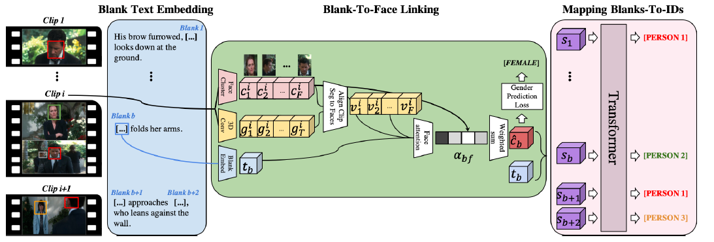

# [Identity-Aware Multi-Sentence Video Description](https://drive.google.com/file/d/1Pe3ygT3KS4pHZXw9TXI78mH_abJZYqB7/view?usp=drivesdk)

## Contributions
- 电视台会使用SOMEONE作为通用标签，描述台本对话，该论文的任务是通过识别人物身份，将身份填充到SOMEONE上
- multi-sentence Identity-Aware Video Description task 多语句身份识别视频描述任务
- overcomes this limitation and requires to re-identify persons locally within a set of consecutive clips 短暂丢失下重新识别人员身份
- Transformer architecture allowing for coherent joint prediction of multiple IDs 允许对多个ID进行一致的联合预测的Transformer结构
- gender-aware textual representation 性别识别的文字描述
- 2-stage流程
  1. multi-sentence video descriptions 第一步是多语句视频描述
  2. Fill-in the Identity model to establish links between the predicted person entities 第二步是使用Fill-in-Identity模型做人员身份预测 (识别多帧中是否为同一人)

## Overview

## Dataset
- Large Scale Movie Description Challenge (LSMDC) benchmark

## References
- [Identity-Aware Multi-Sentence Video Description (PapersAndCode)](https://paperswithcode.com/paper/identity-aware-multi-sentence-video)