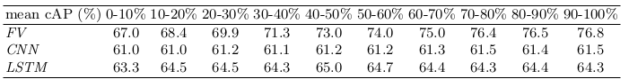

# [Online Action Detection](https://drive.google.com/file/d/159qan3CK1BXiJJ116p8Bl4tjOMJIFk5O/view?usp=drivesdk)

## Overview
主要是提出了一个在线动作检测数据库，并比较了几个算法性能
- introduce a realistic dataset composed of 27 episodes from 6 popular TV series
- analyze and compare various baseline methods
- analyze the change in performance when there is a variation in viewpoint, occlusion, truncation, etc.
  - [Fisher vectors](https://lear.inrialpes.fr/pubs/2010/PSM10/PSM10_0766.pdf) + [improved trajectories](https://hal.inria.fr/hal-00873267v2/document)
  - [deep ConvNet operating on a single frame basis](https://arxiv.org/abs/1409.1556)
  - [LSTM network](https://arxiv.org/abs/1509.04942)
  - [action recognition](https://arxiv.org/abs/1411.4389) 
- introduce an evaluation protocol for fair comparison

## Opinions
- Goal: detect the start of an action in a video stream as soon as it happens
- Challenges:
  - only partial actions are observed
  - a large variability in negative data
  - the start of the action is unknown, so it is unclear over what **time window** the information should be integrated
  - large within-class variability exists 存在大量的类内变异性

## Previous Works
- Early event detection
  - Max-margin early event detectors (CVPR 2012 & IJCV 2014): only the special case of relatively short video fragments with the category label given as prior information
- Classification based methods: choose the most likely action out of a predefined set
- Datasets
  - KTH: Recognizing human actions (ICPR 2004)
  - Actions as space-time shapes (ICCV 2005)

