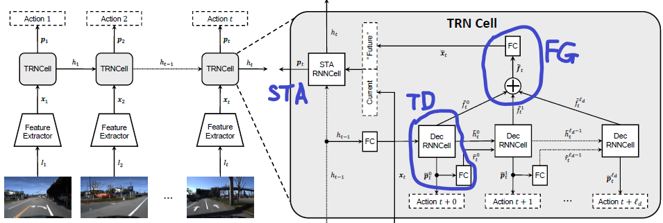
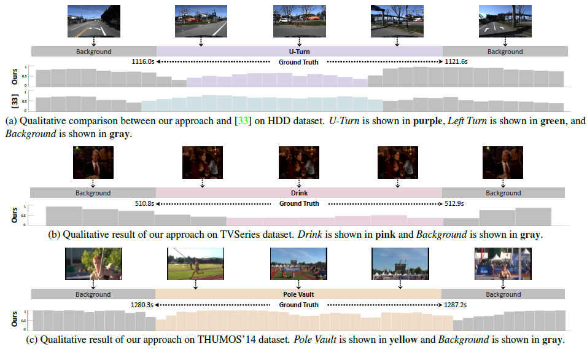

# [Temporal Recurrent Networks for Online Action Detection (TRN)](https://drive.google.com/file/d/1XmDPrrde9hCO-lOeFaSmImaMZe0r6p7c/view?usp=drivesdk)

## Overview
- accumulated historical evidence and predicted future information
- train a network that predicts actions several frames into the future, and then uses that prediction to classify an action in the present 根据历史证据预测未来一段的动作，借此对当前动作做分类
- 对K个可能的动作估计概率分布

## Opinions
- explicitly predicting the future can help to better classify actions in the present.

## Method

- 基本架构就是一个RNN Cell，读入当前t时刻的帧和上一个时刻的隐藏状态，预测当前的动作类型分布
- 内部的结构由三部分组成
  - a temporal decoder: 学习一个特征表达，并预测未来的动作
  - a future gate: 收到decoder的所有隐藏状态并嵌入这些特征作为未来的context 
  - **a spatiotemporal accumulator (STA)**: 根据 过往context ，当前状况  和预测出来的未来context ，预测当前的动作类型分布 

## Dataset
- [HDD](https://paperswithcode.com/paper/toward-driving-scene-understanding-a-dataset)
- TVSeries
- THUMOS’14

## Reference
- [Scene Understanding](https://paperswithcode.com/task/scene-understanding)