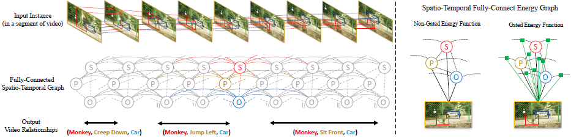

# [Video Relationship Reasoning Using Gated Spatio-Temporal Energy Graph (GSTEG, CVPR 2019)](https://drive.google.com/file/d/1yFGWz5NYWei__zCJ2YnhUhG15HxTpc8h/view?usp=drivesdk)

## Overview
- 在一个全连时空图上 建立一个**条件随机场（CRF）**，以此发掘相关实体在时间和空间上的统计关联 construct a **Conditional Random Field** on a fully-connected spatio-temporal graph that exploits the statistical dependency between relational entities spatially and temporally.
- 使用**门控参数化能量方程**的技术，来学习条件自适应关系 **gated energy function parametrization**
- 门时空能量图（Gated Spatio-Temporal Energy Graph）
  - 每个节点表示一个实体 each node represents an entity
  - 每条边表示一个统计关系 the edges between them denote the statistical relations
- Gated Spatio-Temporal Energy Function 门控时空能量方程
- 使用的不是针对全局的成对能量方程，而是一个基于观测控制的（observation-gated）自适应能量方程 observation-gated version that allows us to make the statistical dependency between entities adaptive
- 具体实现中
  - 对象跟踪：输入的是识别出来的对象的BBox
  - 图像分割：输入的是分割图像

## Definition
- Relationship reasoning
  - detect low-level entities
  - recognize the high-level interaction between them
- 马尔科夫随机场
  - 是随机场的特例，它假设随机场中某一个位置的赋值仅仅与和它相邻的位置的赋值有关，和与其不相邻的位置的赋值无关
- 条件随机场 Conditional Random Fields
  - （最大熵）马尔科夫随机场的特例，它假设马尔科夫随机场中只有X和Y两种变量，X一般是给定的，而Y一般是在给定X的条件下的输出
  - 判别式概率无向图模型，常用于标注或分析序列资料
  - 对统计依赖进行建模 model the statistical dependencies，根据之前的观察生成当前的隐藏状态，根据隐藏状态和当前观察，做出对当前观察的分类
  - 对图像建模
    - Detecting visual relationships with deep relational networks (CVPR 2017)
    - Multiscale conditional random fields for image labeling (CVPR 2004)
    - Viske: Visual knowledge extraction and question answering by visual verification of relation phrases (CVPR 2015)
    - Fully connected deep structured networks (arXiv 2015)
    - Conditional random fields as recurrent neural networks (ICCV 2015)
  - 对视频建模
    - Hidden conditional random fields (PAMI 2007)
    - Asynchronous temporal fields for action recognition (CVPR 2017)
- 熵vs能量vs不确定性
  - 确定 = 不随机 = 熵更小
  - 有序能量（如电能）转化成无需能量（如热能） = 熵增加

## Method
- 输入输出
  - 输入实例 ，比如 `{object trajectories,
predicate trajectories, subject trajectories}` 就含有三个输入流。
  -  本身是一个时间序列 
  - 对应每个  生成标签 。
- 时空全连能量图 Spatio-Temporal Fully-Connected Energy Graph
  - 每个节点是一个实例，每条边是节点间的统计依赖
  - 该图描述了一个基于全局观察  为条件的 马尔科夫随机场。输出是对于每个节点的标签预测  = CRF
- 该CRF 以 Gibbs distribution 的形式进行参数化  
  - 为配分函数 （partition function）
  -  为conditional label分布的能量
- 由于在该能量图中，只有会成对预测（主语，宾语），则上面的能量方程被改写为
   
  -   是单个节点预测的能量（unary energy）
  -  为成对节点预测的能量， 为标签兼容性矩阵（label compatibility matrix）， 为 亲和核测量值（affinity kernel measurement）
  
- 在该视频推理的应用中 成对节点条件预测能量
  -  为 i，j 位置处的输入特征（像素）
  -  为 i，j 位置处的segment label
  - 具体定义是 _{X,t,t',k,k',y_t^k,y_{t'}^{k'}}"/>
    -  为离散查找表格（lookup table）
    - 输出的是一个  大小的转移矩阵（transition matrix），每个元素是每个class对应另一个class的激活值
  - _{X,t,t',k,k',y_t^k,y_{t'}^{k'}}=\left\{\begin{matrix}\left<g_\theta^{kk'}(X_t^k)\otimes h_\theta^{kk'}(X_t^k)\right>_{y_t^k,y_{t'}^{k'}} \\ K_\sigma(t,t')\left<r_\theta^{kk'}(X_t^k)\otimes s_\theta^{kk'}(X_t^k)\right>_{y_t^k,y_{t'}^{k'}}\end{matrix}\right."/>
  -  为高斯核
  - 
  - , , ,  为全连网络

## References
- [ArXiv](https://arxiv.org/abs/1903.10547)
- [CVF](https://openaccess.thecvf.com/content_CVPR_2019/papers/Tsai_Video_Relationship_Reasoning_Using_Gated_Spatio-Temporal_Energy_Graph_CVPR_2019_paper.pdf)
- [Github (PyTorch)](https://github.com/yaohungt/Gated-Spatio-Temporal-Energy-Graph)