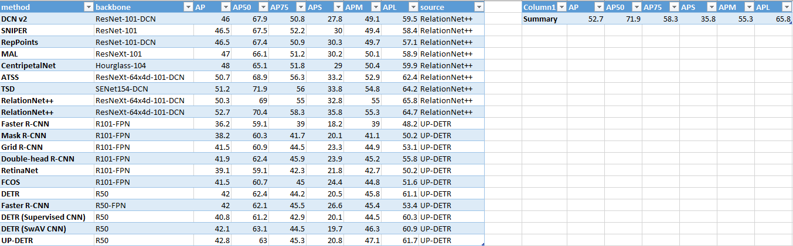

# Computer Vision

## 1. Dataset
### 1.1. [General Object Detection](dataset.md)
- COCO Detection 2014, 2015, 2017
  - 

- KITTI Object
  - [Benchmark](http://www.cvlibs.net/datasets/kitti/eval_object.php?obj_benchmark=2d)
- KITTI-360
- Cityscapes
- PASCAL VOC

### 1.2. Face Detection
- [WiderFace](http://shuoyang1213.me/WIDERFACE/)

## 2. Metrics
### 2.1. Detection
- AP (Average Precision)
  - The area under the precision-recall curve (PR curve).
  - In the case of objection detection or instance segmentation, this is done by changing the score cutoff.

- mAP (mean AP)
  - simply all the AP values averaged over different classes/categories.

- IoU

### 2.2. Segmentation
- Pixel error
- Rand error
- Warping error
- MIoU 

## 3. Conferences
- [IEEE ICCV (International Conference on Computer Vision)](http://iccv2019.thecvf.com/)
- [IEEE CVPR](http://cvpr2020.thecvf.com/)
- [ECCV (European Conference on Computer Vision)](https://eccv2020.eu/)
- [MICCAI (Medical Image Computing and Computer-Assisted Intervention)](http://www.miccai.org/)