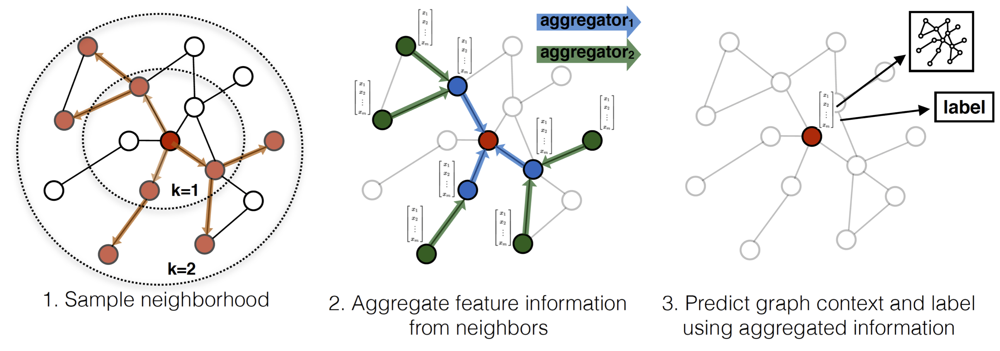

# [Inductive Representation Learning on Large Graphs (GraphSAGE NIPS 2017)](https://drive.google.com/file/d/1pCCEMi3FGAIkDTvfuGKa54snDKVVQDU6/view?usp=drivesdk)

## Overview
- **inductive** 归纳式的，可以根据以往的数据训练出来的卷积核，应用到未见过的图
- 收集局部邻近节点信息，来生成嵌入（**embedding generation**）

## Method

- 前提：
  - 提前已经知道图的连接结构
  - 提前知道节点特征
- Embedding generation 流程（模型训练完成后的使用过程）
  - 目的：学习K个聚合函数 (aggregator functions)，K表示聚合深度（K=1表示只考虑最邻近的节点）
  1. 先对邻居随机采样，降低计算复杂度（图中一跳邻居采样数=3，二跳邻居采样数=5）
  2. 生成目标节点emebedding
     1. 先聚合2跳邻居特征 (绿色节点)，生成一跳邻居（蓝色节点）embedding 
     2. 再聚合（concat）一跳邻居（蓝色节点）embedding，生成目标节点（红色节点）embedding，从而获得二跳邻居信息。
  3. 将embedding作为全连接层的输入，预测目标节点的标签。
   
- Weisfeiler-Lehman Isomorphism Test 图同构性测试
  - 如果K=全部节点数量，W为单位矩阵（identity matrix），聚合函数是hash function，则GraphSAGE等同于Weisfeiler-Lehman Isomorphism Test
  - 即如果对两个网络计算聚合函数，最后算出来的值一致，则表示两个网络同构
- 聚合函数
  - 平均聚合：先对邻居embedding中每个维度取平均
  - 归纳式聚合：直接对目标节点和所有邻居emebdding中每个维度取平均
  - LSTM聚合：对邻居随机排序后，使用LSTM输出隐向量
  - Pooling聚合器：先对每个邻居节点上一层embedding进行非线性转换，再按维度应用 max/mean pooling，捕获邻居集上在某方面的突出的／综合的表现 以此表示目标节点embedding
- 损失函数设定
  - 无监督：希望节点u与"邻居"v的embedding也相似（对应公式第一项），而与"没有交集"的节点vn不相似 
    - zu是节点u通过GraphSAGE生成的embedding
    - 节点v是节点u随机游走访达"邻居"
    - 表示负采样：节点vn是从节点u的负采样分布Pn采样的，Q为采样样本数
    - embedding之间相似度通过向量点积计算得到
  - 有监督损失：无监督损失函数的设定来学习节点embedding 可以供下游多个任务使用，若仅使用在特定某个任务上，则可以替代上述损失函数符合特定任务目标，如交叉熵

## Dataset
- [Pushshift (Reddit posts)](https://pushshift.io/)
- [BioGRID protein-protein interaction (PPI)](https://downloads.thebiogrid.org/BioGRID)

## References
- [GraphSAGE: GCN落地必读论文](https://zhuanlan.zhihu.com/p/62750137)