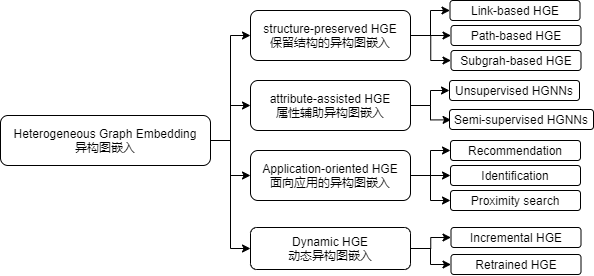

# [A Survey on Heterogeneous Graph Embedding: Methods, Techniques, Applications and Sources (ArXiv 2020)](https://drive.google.com/file/d/1WYsaTfMZ66eAxdKgGCRCop9YbR4C6TVD/view?usp=drivesdk)

## Introduction
- aims to learn representations in a lower-dimension space while preserving the heterogeneous structures and semantics for downstream tasks 目的是为下游任务学习异构结构和语义
- 特点
  - HG structure is usually semantic dependent HG结构经常是语义相关的，各处本地的连结结构可能非常不同
  - different types of nodes and edges have different attributes HG的节点和边含有的特征也不同，可能处在不同特征空间
- 相关定义
  - Heterogeneous graph: 节点类型+边类型 > 2
  - Meta-path：基于一个network schema S，统一描述不同类型节点间的关系 。但是Meta-path不能获取更复杂的关系，如动机。
  - Meta-graph：一个有向无环图(DAG)，由多个meta-path组成。有APA和APCPA两种类型。
- Shallow 浅层模型：
  - Random walk-based
  - Decomposition-based
- Deep Model 深层模型
  - Message passing-based
  - Encoder-decoder-based
  - Adversarial-based

## Challenges 挑战
- Complex structure
  - [metapath2vec (KDD 2017)](metapath2vec.md)
  - [metagraph2vec (PAKDD 2018)](metagraph2vec.md)
- Heterogeneous attributes
  - node cannot directly fuse the information of its neighbors with different dimensions
  - [Heterogeneous graph neural network (HetGNN, KDD 2919)](heterogeneous_graph_neural_network.md)
  - [Heterogeneous graph attention network (HAN, WWW 2019)](heterogeneous_graph_attention_network.md)
- Application dependent
  - 需要根据domain knowledge来构建图结构和attribute

## Categories 分类

- Structure-preserved HGE：使用meta-path或meta-graph保存异构结构和语义
  - Link-based HG Embedding
  - Path-based HG Embedding
  - Subgraph-based HG Embedding
  - 总结：良好的可平行计算性，但需要增加计算量，不适合大规模工业应用
- Attribute-assisted HGE：增加结构外的信息
  - Unsupervised HGNNs：通过学习不同attribute间的互动捕获可能的共性（commonalities）
    - [HetGNN (KDD 2019)](heterogeneous_graph_neural_network.md) 有三个部分：content, neighbor and type aggregation.
    - [HNE (KDD 2015)](https://www.eecs.ucf.edu/~gqi/publications/kdd2015_heterogeneous.pdf) 学习跨模型数据的嵌入，而忽略连接的不同类型
    - [SHNE (WSDM 2019)](https://dl.acm.org/doi/pdf/10.1145/3289600.3291001) 通过设计一个深度GRU语义encoder，抓取节点语义信息
    - [GATNE (KDD 2019)](gatne.md)：识别节点对间的不同连接关系
  - Semi-supervised HGNNs
    - [Heterogeneous graph attention network (HAN, WWW 2019)](heterogeneous_graph_attention_network.md) 
    - Attention-based semi-supervised HGNNs
      - [MAGNN (WWW 2020)](MAGNN.md) 设计intra-meta-path和inter-meta-path aggregation
      - [HetSANN (AAAI 2020)](https://arxiv.org/pdf/1912.10832.pdf) 和 [HGT (WWW 2020)](https://arxiv.org/pdf/2003.01332.pdf) 处理一个类型节点是通过计算其周围其他类型的节点重要性
    - [NSHE (IJCAI 2020)](https://www.ijcai.org/proceedings/2020/0190.pdf) 合并网络架构 (network schema)，而非合并meta-path，或合并邻近节点信息
    - [GTN (NIPS 2019)](https://arxiv.org/pdf/1911.06455.pdf) 自动识别有用的meta-path和high-order连接
    - [RSHN (ICDM 2019)](https://ieeexplore.ieee.org/document/8970828) 使用原始节点图和粗粒化线图 来设计relation-structure aware HGNN
    - [RGCN (ESWC 2018)](modeling_relational_data_with_graph_convolutional_networks.md) 使用多权重矩阵，来将节点嵌入映射到不同的关联空间
  - 总结：有良好的推导性能，更少的内存消耗
- Application-oriented HGE：发掘异构图嵌入的应用性
  - Recommendation (推荐系统)
    - HG
    - HeteLearn
    - SemRec
    - [HERec (ITKDE 2019)](heterogeneous_information_network_embedding_for_recommendation.md)：学习不同meta-path下用户和货品的嵌入，并寻找共享关系 (co-occurrence)。通过计算同一用户在不同meta-path中的embeddings的平均值来计算针对该用户的fusion
    - [MCRec (KDD 2018)](leveraging_metapath_based_context_for_top-n_recommendation_with_a_neural_coattention_model.md)
  - Identification 
    - 作者识别：[Camel (WWW 2018)](camel.md) 通过考虑论文内容和共现的应用论文来识别匿名论文
    - 用户识别：由于没有一对一关系，所以主要只是识别用户嵌入特征向量 [Player2vec (CIKM 2019)](Player2vec.md)，[AHIN2vec (IJCAI 2019)](enhancing_social_coding_security_by_cross-platform_user_identification_between_GitHub_and_stack_overflow.md)，[Vendor2vec (WWW 2019)](./Vendor2vec.md) 
    
  - Proximity Search 邻近搜索
    - [Prox (AAAI 2017)](http://www.findshine.com/me/downloads/papers/aaai17-Semantic_Proximity_Search_on_Heterogeneous_Graph_by_Proximity_Embedding.pdf) 利用HGE省去feature engineering，使用HGE做邻近搜索
    - [IPE (KDD 2018)](http://shichuan.org/hin/time/2018.KDD%202018%20Interactive%20Paths%20Embedding%20for%20Semantic%20Proximity%20Search%20on%20Heterogeneous%20Graphs.pdf) 将不同meta-path之间的互动加入考虑，用以提高HGE性能
    - [SPE (WWW 2018)](https://dl.acm.org/doi/pdf/10.1145/3178876.3186073) 提出使用一个堆叠autoencoder来学习子图嵌入，以提高语义临近搜索
    - [D2AGE (AAAI 2018)](https://www.aaai.org/ocs/index.php/AAAI/AAAI18/paper/viewFile/16770/15987) 探索DAG（distance-aware dag）结构
- Dynamic HGE
  - Incremental HG Embedding
    - [DyHNE](https://ieeexplore.ieee.org/document/9091208) 基于矩阵扰动（matrix perturbation）理论来学习节点嵌入，同时考虑异构性和HG的演进。矩阵扰动 通过邻接矩阵（adjacency matrix）来抓取一阶邻近和二阶邻近节点的变化。尤其直接更新节点嵌入，而不用训练整个模型
  - Retrained HG Embedding
    - **[DyHATR (ECML PKDD 2020)](DyHATR.md)** 通过节点嵌入的改变，抓取时序信息

## dds
- 恶意软件检测
  - [Hindroid (KDD 2017)](hindroid-an-intelligent_android_malware_detection_system_based_on_structured.md)
  - [Scorpion (KDD 2018)](https://www.kdd.org/kdd2018/accepted-papers/view/gotcha-sly-malware-scorpion-a-metagraph2vec-based-malware-detection-system)
  - Out-of-sample node representation learning for heterogeneous graph in real-time android malware detection (IJCAI 2019)
  - αcyber: Enhancing robustness of android malware detection system against adversarial attacks on heterogeneous graph based model (CIKM 2019)
- 医疗保健系统 healthcare systems
  - Multi-information source HIN for medical concept embedding (PAKDD 2020)
  - Heteromed: Heterogeneous information network for medical diagnosis (CIKM 2018)