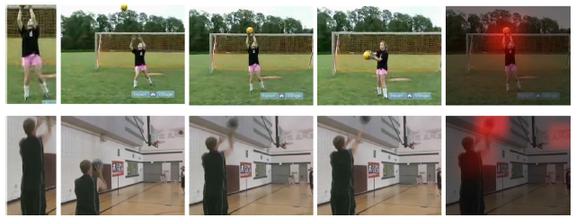
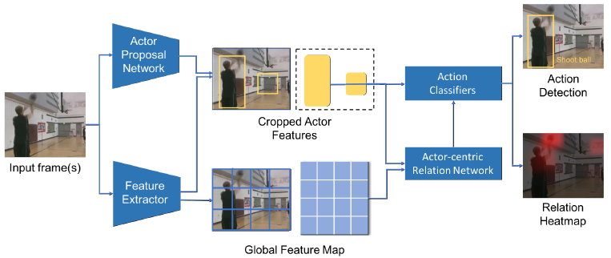

# Actor-Centric Relation Network (ACRN ECCV 2018)

## Overview

- 通过图神经网路，对视频中actors的时空关系建模
- 弱监督，自动挖掘相关元素 weakly supervised and mines the relevant elements automatically
- 计算actor间配对关系信息 compute pair-wise relation information from the actor and scene features
- 使用3D卷积神经网络获取时空信息 use the temporal context as inputs to ACRN. Such context is captured by 3D ConvNets

## Related works
- [JHMDB]()
- [AVA]()

## Dataset
- AVA
- SLAC
- Charades

## References
- [Google Research](https://research.google/pubs/pub47219/)
- [Arxiv](https://arxiv.org/abs/1807.10982)