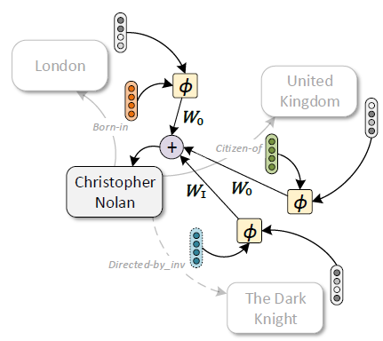

# [Composition-based Multi-Relational Graph Convolutional Networks (CompGCN ICLR 2020)](https://drive.google.com/file/d/1S3rd-aoRJ94nFaIIHneSZulW-JkIota4/view?usp=drivesdk)

## Overview
- 同时学习节点和关系的表示 jointly embeds both nodes and relations in a relational graph.

## Method

- 多关系图表示为 ，其中表示初始化的关系特征向量
- 组合运算符（composition operator）
  -  o: object, s: subjective, r: relation 
  - 无参运算类型
    - subtraction
    - multiplication
    - circular-correlation
  - 含参运算类型
    - Neural Tensor Networks (NTN)
    - ConvE
- 3种边类型：
  - 有向边  
  - 反向边  
  - 自连边 
- 中心节点v的聚合过程
  - 
- relation-type specific parameter  是根据不同relation类型使用不同的权重  

## Dataset
- Link Prediction
  - [FB15k (Freebase 15K)](https://paperswithcode.com/dataset/fb15k)
  - [WN18RR (WordNet)](https://paperswithcode.com/dataset/wn18rr)
- Node Classification
  - [MUTAG (predict mutagenicity on Salmonella typhimurium 预测鼠伤寒沙门氏菌的致突变性)](https://paperswithcode.com/dataset/mutag)
  - [Amsterdam Museum artifacts relationship](https://data.europa.eu/data/datasets/oh3dbp9vsnnt2g?locale=en)
- Graph Classification
  - (Predictive Toxicology Challenge 预测性毒理学挑战)[https://relational.fit.cvut.cz/dataset/PTC]

## Metrics
- Mean Reciprocal Rank (MRR)
- Mean Rank (MR)
- Hits@N

## References
- [20ICLR 多关系图神经网络 CompGCN](https://zhuanlan.zhihu.com/p/109738386)
- [arXiv](https://arxiv.org/abs/1911.03082)
- [ICLR 2020](https://iclr.cc/virtual_2020/poster_BylA_C4tPr.html)