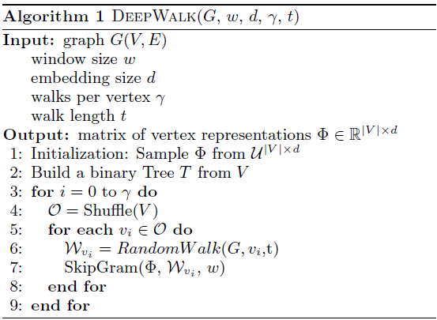
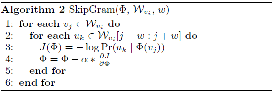

# [DeepWalk: Online Learning of Social Representations (KDD 2014)](https://drive.google.com/file/d/1_NirEwXW48H5SeWV4QsRHlfR5vlgL030/view?usp=drivesdk)

## Overview
- 将社会关系encode为一个**连续向量空间**下的**隐藏表达**
- 将[word2vec](word2vec.md)引入社交网络表达学习中
- 过去的特征学习需要label信息（supervised），但是deepwalk完全不需要label（unsupervised）
- 截断随机游走（深度优先遍历）+神经语言模型 结合形成的网络表示，它具有低维、连续和适应性特征
- 在graph上随机构造"句子"，然后直接使用word2vec模型训练得到graph中每个node的embedding表示
 
## Definitions
- corpus = short truncated random walks
- vocabulary = graph vertices

## Method
- random walk generator：
  - 输入一个图G，随机选取一个vertex  作为random walk的初始节点（root）
  - 之后又随机选取其邻居节点，直到最大长度t停止
  - **对每个顶点生成γ条长度为t的随机路径**
  - 跳转概率和跳转节点的出边权重正相关(跳转概率 = 当前出边权重/所有出边的权重和)
  - 
- update procedure
  - 输入的是上次学习到的顶点表达集合 Φ
  - 对于每个生成的随机路径，基于SkipGram更新节点表达
  - 最后SkipGram需要学习参数，使得给定vj，其邻居uk获得最大概率
  - 

## Others
- Hierarchical Softmax
  - 由于顶点的原始sample数量 |V| 非常大，计算vj所有邻居的概率基本不可能，所以使用Hierarchical Softmax
  - 将所有vertex作为二叉树的叶节点，则预测问题就会简化成最大化一条路径概率的问题。
  - 如果到uk的路径是一系列枝干节点序列（b0，b1, ...），那么到达叶节点要经过log(|V|)个枝干节点。由此可以得到 
  - 由此可以将条件概率的复杂度从O(|V|)见到O(log|V|)
  - label（叶节点）出现的频率越高，Huffman树的路径越短

## References
- [GitHub](https://github.com/phanein/deepwalk)
- [arXiv](https://arxiv.org/pdf/1403.6652.pdf)
- [【论文笔记】DeepWalk](https://zhuanlan.zhihu.com/p/45167021)
- [【Graph Embedding】DeepWalk：算法原理，实现和应用](https://zhuanlan.zhihu.com/p/56380812)