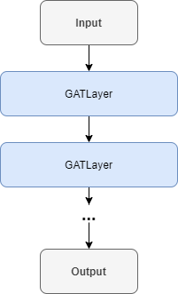
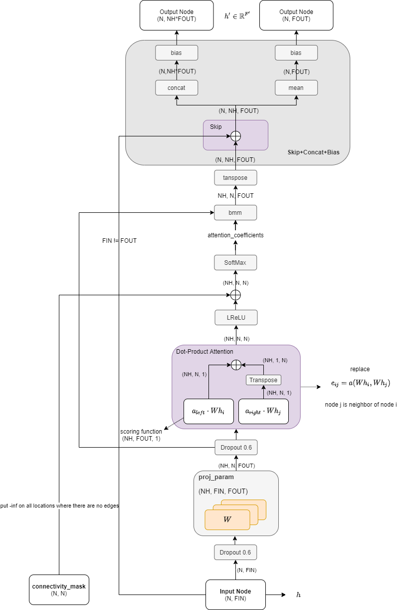
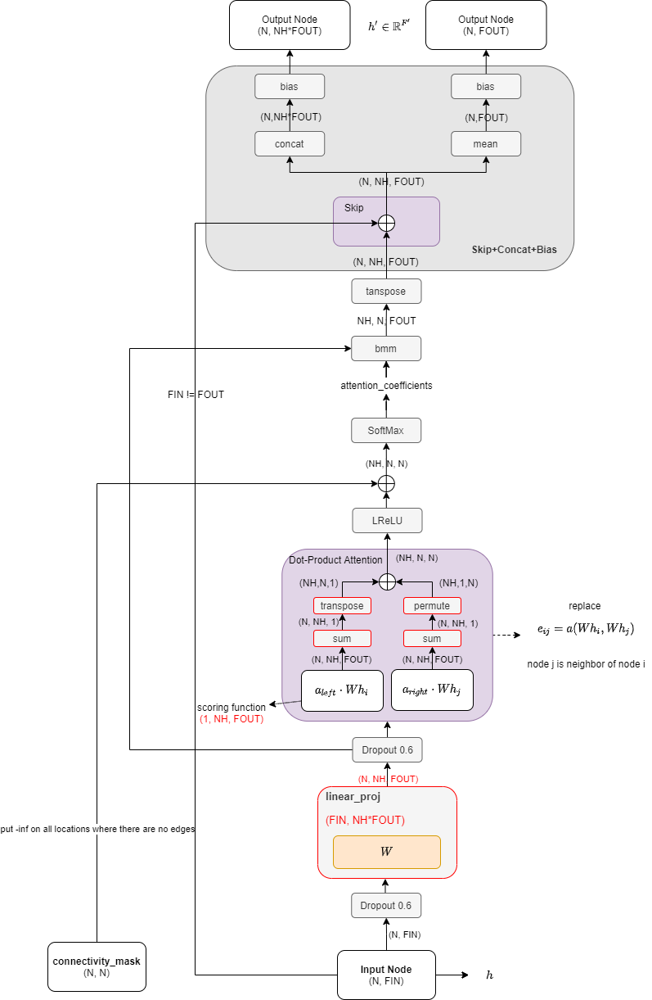
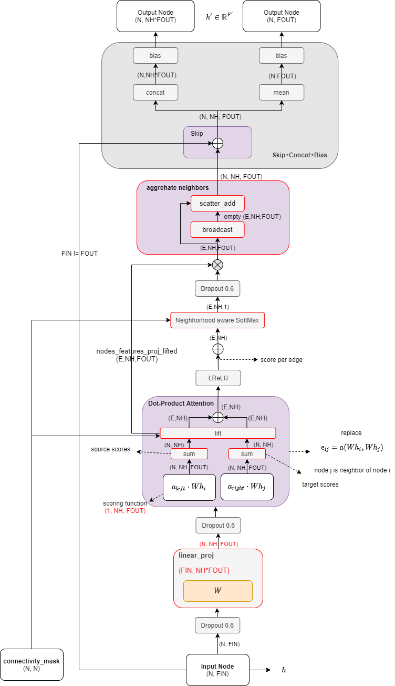

# [Graph attention networks (ICLR 2018)](https://drive.google.com/file/d/1p-HlICyu1YmojhFb3ai2Mj96hDn8yJ7j/view?usp=drivesdk)

## Overview

- 核心概念是masked self-attentional layers
- 通过叠加layers，node就可以获取它邻近nodes的特征
- 对邻域中的不同节点指定不同的权重 specify different weights to different nodes in a neighborhood

## Benefits
- 允许处理不同长度的输入数据(or degree) allow for dealing with variable sized inputs
- self-attention的特点: compute a representation of a single sequence
- the operation is efficient < it is parallelizable across nodeneighbor pairs
- directly applicable to inductive learning problems (归纳学习问题，即根据已有的个例推导一般规则), including tasks where the model has to generalize to completely unseen graphs
- The graph is not required to be undirected 允许有向图
- does not suffer from feeding sequence—it works with the entirety of the neighborhood 不受输入顺序的影响

## Methods
- graph attentional layer: 
  - 输入一系列节点特征 node feature
  - 输出一系列新的节点特征
  - 学习attention coefficients，来表达节点 j 对于节点 i 的重要性

===

===

===

## Previous works
- 基于频谱的图卷积的发展与缺点
  - [Bruna et al. 2014]() 的拉普拉斯算子的特征分解操作计算量很大，且没有基于位置的滤波器
  - [Henaff et al. 2015](deep_convolutional_networks_on_graph-structured_data.md) 引入一个参数化的频谱滤波器，使其具有平滑的系数，以便使其在空间上得到定位
  - [Defferrad et al. 2016](https://arxiv.org/abs/1606.09375) 通过图的切比雪夫展开（Chebyshev expansion）来近似Laplacian滤波器，消除了计算特征向量求解的需要，产生了空间上的局部化的滤波器
  - [Kipf & Welling (ICLR 2017)](semi-supervised_classification_with_graph_convolutional_networks.md) 将滤波器限制在1个步长的最邻近节点
  - 所学的过滤器取决于Laplacian eigenbasis，而其又取决于图的结构。因此，在特定结构上训练的模型不能直接应用于不同结构的图（Thus, a model trained on a specific structure can not be directly applied to a graph with a different structure）。
  - **图神经网络不像图片那样节点关系是固定的，而GCN必须基于相同的节点关系才有效，如果连接关系发生变化就不能用了**
- 基于空间的图卷积的发展与缺点
  - 使用基于空间的图卷积神经网络，直接操作空间邻近节
  - **挑战是如何使用一个operator来处理不同数量的邻近节点结构（different sized neighborhoods）而同时依然保持对权重的共享**
  - [Duvenaud et al. 2015](convolutional_networks_on_graphs_for_learning_molecular_fingerprints.md) 为每个degree（邻近节点数）都学习一个权重矩阵
  - [Atwood & Towsley 2016](diffusion-convolutional_neural_networks.md) 使用transition matrix 来学习每种输入channel和邻近节点数的权重
  - [Niepert et al. 2016]() 规定了邻近节点的数量必须是个固定值
  - [Monti et al. 2016]() 的MoNet使用混合模型，实现了CNN在graph上的泛化使用
  - [Hamilton et al. 2017]() 的GraphSAGE使用了一种方法，以归纳的方式（inductive manner）计算节点表征。只随机取样固定数量的临近节点
  

## Datasets

- Cora
- Citeseer
- Pubmed
- protein-protein interaction

## 重要概念
- 归纳（induction）与演绎（deduction）是科学推理的两大基本手段。
- 归纳是从“具体到一般”的过程。也就是从一些实例中总结规律的过程。打个比方说：给你一堆猫咪，给你一堆狗狗，然后你总结出如何区别猫和狗。
- 演绎是从“一般到特殊”的过程，也就是说基础原理推演出具体情况。例如你现在已经有了一套关于猫猫和狗狗的事实和规则。忽然来了个小动物，你根据你的知识推理出这只小家伙是猫咪是狗狗。

## References

- [P. Velickovic, G. Cucurull, A. Casanova, A. Romero, P. Lio, and Y. Bengio, "Graph attention networks" ICLR 2018, 2018](https://arxiv.org/abs/1710.10903)
- [Github PetarV-/GAT](https://github.com/PetarV-/GAT)