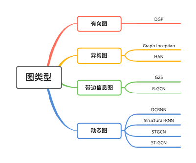
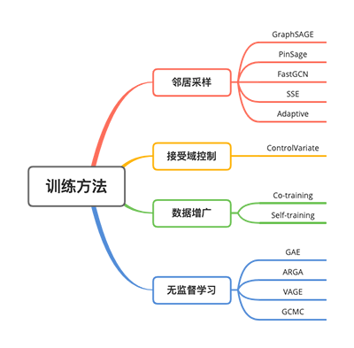
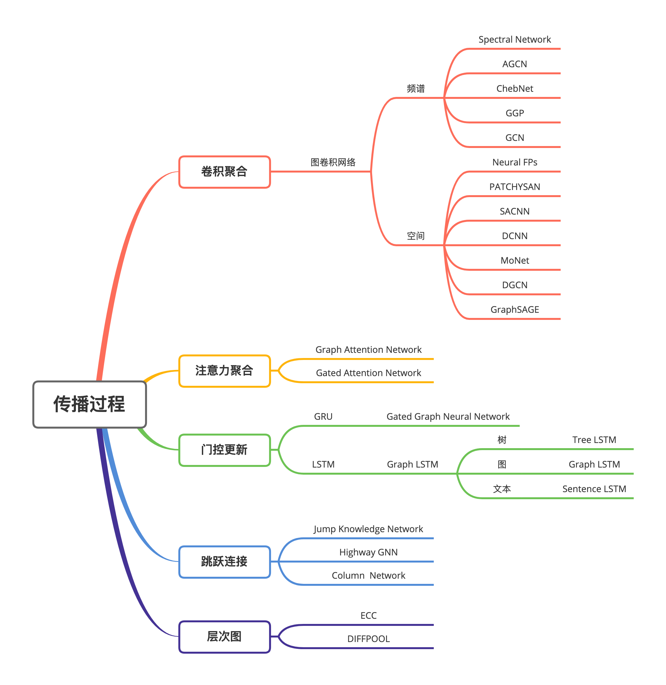
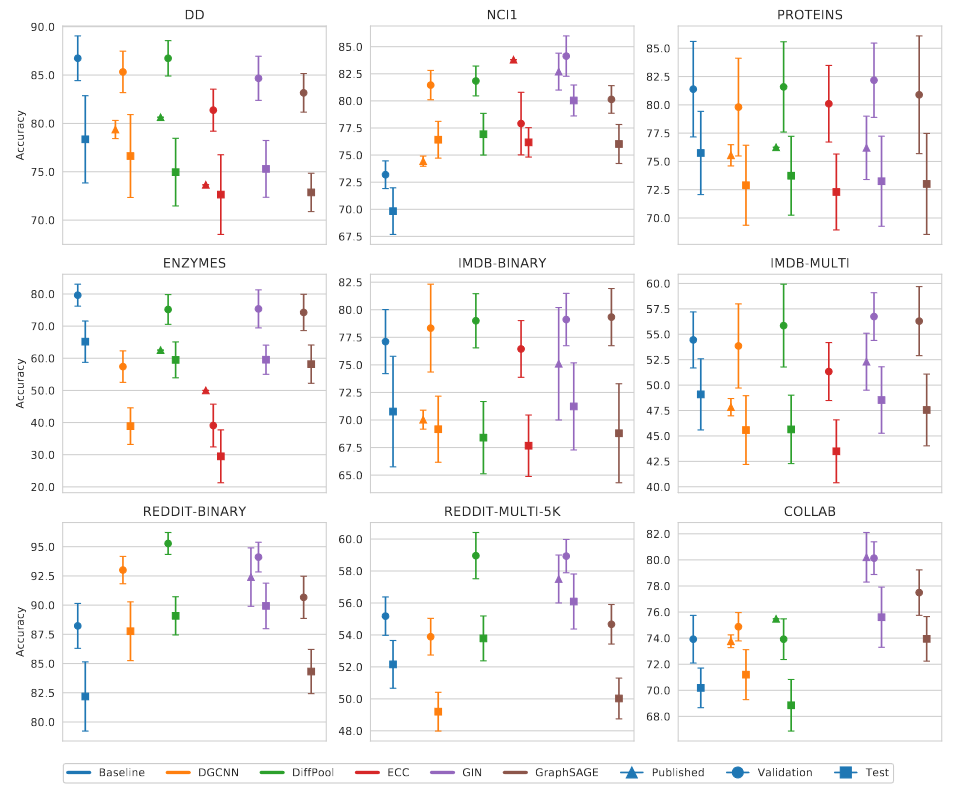

# Graph Neural Networks

## Overview

## Concept
- Edge types
  - self-edge
  - multigraph
- Comparison Between Spectral and Spatial Models
  - 基于谱的模型仅限于在无向图上工作，基于谱的模型应用于有向图的唯一方法是将有向图转换为无向图。基于空间的模型更灵活地处理多源输入，这些输入可以合并到聚合函数中。因此，近年来空间模型越来越受到关注。
  - 基于谱的模型假定一个固定的图，使得它们很难在图中添加新的节点。基于空间的模型在每个节点本地执行图卷积，可以轻松地在不同的位置和结构之间共享权重。
    - spectral model: **transductive** 直推式的，do not generalize to unseen nodes
    - spatial model: **inductive** 归纳式的，可以处理 evolving information（不断演进的信息）
  - 效率方面，基于谱的模型的计算成本随着图的大小而急剧增加，因为它们要么需要执行特征向量计算，要么同时处理整个图。基于空间的模型有潜力处理大型图，因为它们通过聚集相邻节点直接在图域中执行卷积。
- 图注意力网络的优点
  - 聚合过程中使用注意力，整合多个模型的输出，并生成面向重要目标的随机行走
  - 门控注意力网络（GAAN）还采用了多头注意力机制来更新节点的隐藏状态
  - 与GCN对于节点所有的邻居平等对待相比，注意力机制可以为每个邻居分配不同的注意力评分，从而识别更重要的邻居。

## Basic Papers
- [A new model for learning in graph domains (IJCNN 2005)](https://ieeexplore.ieee.org/document/1555942)
- [The graph neural network model (IEEE TNN 2009)](https://ieeexplore.ieee.org/document/4700287)
- [A Comprehensive Survey on Graph Neural Networks (ArXiv 2019)](https://drive.google.com/file/d/1diu1q5KhEtGLGyiJ9-XBDpZdoDt9ttLJ/view?usp=drivesdk)
- [图神经网络（Graph Neural Networks，GNN）综述](https://zhuanlan.zhihu.com/p/75307407)
- [A Fair Comparison of Graph Neural Networks for Graph Classification (ICLR 2020)](https://drive.google.com/file/d/1GXeHIPOtALxfaLyK6BKYVEabLDFZm2QJ/view?usp=drivesdk)

- [What Can Neural Networks Reason About (ICLR 2020)](what_can_neural_networks_reason_about.md)

## Dataset
- [Cora](https://relational.fit.cvut.cz/dataset/CORA)
  - 2708 scientific publications classified into one of seven classes
  - [图数据集之cora数据集介绍](https://blog.csdn.net/yeziand01/article/details/93374216)
- [Pushshift (Reddit posts)](https://pushshift.io/)
- [BioGRID protein-protein interaction (PPI)](https://downloads.thebiogrid.org/BioGRID)

## References
- [图嵌入 (Graph Embedding) 和图神经网络 (Graph Neural Network) &#128293;](https://leovan.me/cn/2020/04/graph-embedding-and-gnn/)