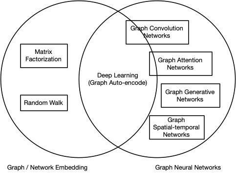

# Graph Theory

## 优点
- 图结构使简单网络拥有强大推理(分类)能力
  - [Mean-field theory of GNNs in graph partitioning (NIPS 2018)](mean-field_theory_of_GNNs_in_graph_partitioning.md)
- Based on CNNs and graph embedding, GNNs are proposed to collectively aggregate information from graph structure. Thus they can model input and/or output consisting of elements and their dependency. Further, graph neural network can simultaneously model the diffusion process on the graph with the RNN kernel. [[Graph Neural Networks: A Review of Methods and Applications]](https://drive.google.com/file/d/1ue7r5P48NWupzuYDj6Dkt-lKKBQmNclh/view?usp=drivesdk)

## 概念
- 当所有的边为有向边时，图称之为有向（Directed）图，当所有边为无向边时，图称之为无向（Undirected）图。
- Embedding 是一个将离散变量转为连续向量表示的一个方式
- [**图嵌入**](graph_embedding.md)：<u>旨在将图的节点表示成一个低维向量空间，同时保留网络的拓扑结构和节点信息</u>，以便在后续的图分析任务中可以直接使用现有的机器学习算法。
- [**图神经网络**](graph_neural_network.md)（Graph Neural Networks, GNN）：

## 挑战
- Non-Euclidean domain space 非欧几里得空间
- no parameters are shared between nodes in the encoder 没能分享网络参数，而导致低效率
  - transform CNN from Euclidean domain to non-Euclidean domain 无法将卷积应用在非欧几里得域
- represent graph nodes, edges or subgraphs in low-dimensional vectors 如何在低维空间下表达节点，边和子图（见[图嵌入]((graph_embedding.md))）
- traverse all the possible orders 反复推敲所有可能的节点顺序
  - 在每个节点分别传播梯度,而不考虑输入顺序
- reasoning 实现推理
  - relational reasoning（关系推理）
    - [Actor-Centric Relation Network [3D ConvNet] (ECCV 2018)](actor-centric_relation_network.md)
    - [A simple neural network module for relational reasoning](a_simple_neural_network_module_for_relational_reasoning.md)
  - heuristic reasoning (启发式推理)
    - [Heuristic Reasoning on Graph and Game Complexity of Sudoku](heuristic_reasoning_on_graph_and_game_complexity_of_sudoku.md)
- 浅层结构
  - 经验上使用更多参数的神经网络能够得到更好的实验效果，然而堆叠多层的 GNN 却会产生 over-smoothing 的问题。
  - 具体来说，堆叠层数越多，节点考虑的邻居个数也会越多，导致最终所有节点的表示会趋向于一致。
- 动态图和异质性
  - 目前大部分方法关注于在静态图上的处理，对于如何处理节点信息和边信息随着时间步动态变化的图仍是一个开放问题。
- 非结构化场景
  - 虽然很多工作应用于非结构化的场景（比如文本），然而并没有通用的方法用于处理非结构化的数据。
- 扩展性
  - 虽然已经有一些方法尝试解决这个问题，将图神经网络的方法应用于大规模数据上仍然是一个开放性问题。
- 感受野
  - 节点的感受野是指一组节点，包括中心节点和其近邻节点
  - 节点的近邻（节点）数量遵循幂律分布。有些节点可能只有一个近邻，而有些节点却有数千个近邻。尽管采用了采样策略，但如何选择节点的代表性感受野仍然有待探索。

## Summary

- 图卷积网络 GCN
  - spectral graph theory
    - 谱方法通常同时处理整个图，并且难以并行或扩展到大图上
  - spatial GCN
    - 通过聚集近邻节点的信息，直接在图结构上执行卷积，结合采样策略，计算可以在一个批量的节点而不是整个图中执行，这种做法有望提高效率
    - 基于空间的图卷积网络开始快速发展
- 图注意力网络 GAT
- 图自编码器
- 图生成网络
- 图时空网络
    

## Dataset
- [Cora](https://relational.fit.cvut.cz/dataset/CORA)
- [Pushshift (Reddit posts)](https://pushshift.io/)
- [BioGRID protein-protein interaction (PPI)](https://downloads.thebiogrid.org/BioGRID)

## References:
- [Graph Neural Networks: A Review of Methods and Applications](https://drive.google.com/file/d/1ue7r5P48NWupzuYDj6Dkt-lKKBQmNclh/view?usp=drivesdk)
- [A comprehensive survey on graph neural networks (TNNLS 2020)](https://arxiv.org/abs/1901.00596)
- [Deep Learning on Graphs: A Survey (arxiv 2018)](https://drive.google.com/file/d/1pxrw-Eofu0Q3iDg-GR0lwvLepLxtU0gc/view?usp=drivesdk)
- [4 Graph Neural Networks you Need to Know (WLG, GCN, GAT, GIN)](https://pub.towardsai.net/4-graph-neural-networks-you-need-to-know-wlg-gcn-gat-gin-1bf10d29d836)
  - WLG: Weisfeiler-Lehman Graph Kernel (Shervashidze et al., 2011)
  - GCN: Graph Convolutional Network (Kipf and Welling, 2017)
  - GAT: Graph Attention Networks (Veličković et al., 2017)
  - GIN: Graph Isomorphism Network (Xu et al., 2019)
- [图神经网络](https://www.jiqizhixin.com/graph/technologies/c39cf57b-df95-4c9e-9a8a-0d8ea330d625)