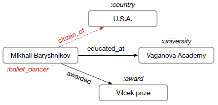
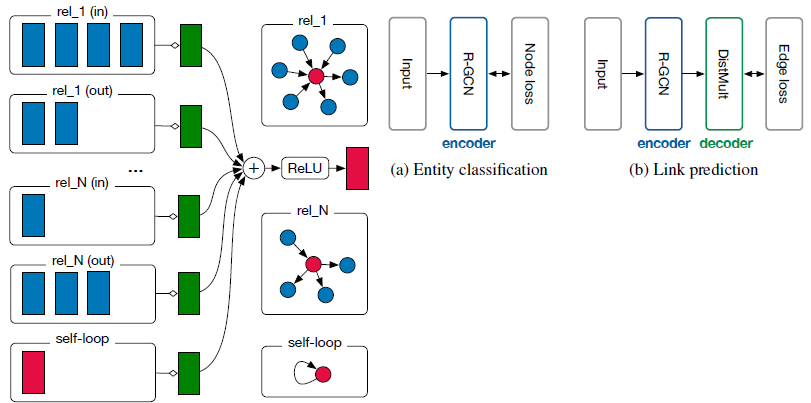

# [Modeling Relational Data with Graph Convolutional Networks (ESWC 2018)](https://drive.google.com/file/d/1wIa38POTIo0wGm4vnSBPQFkfK4uuFzLL/view?usp=drivesdk)

## Overview
- deal with highly multi-relational data characteristic of realistic knowledge bases
- R-GCN本身可以做entity classification
- R-GCN的encoder结合因式分解模型（factorization models）如DistMult，可以增强link prediction的效果

## Dataset
- Link Prediction
  - [FB15k (Freebase 15K)](https://paperswithcode.com/dataset/fb15k)
  - [WN18RR (WordNet)](https://paperswithcode.com/dataset/wn18rr)
- Node Classification
  - [MUTAG (predict mutagenicity on Salmonella typhimurium 预测鼠伤寒沙门氏菌的致突变性)](https://paperswithcode.com/dataset/mutag)
  - [Amsterdam Museum artifacts relationship](https://data.europa.eu/data/datasets/oh3dbp9vsnnt2g?locale=en)
  - [AIFB Dataset](https://figshare.com/articles/dataset/AIFB_DataSet/745364)
    - Semantic Web (RDF) dataset used as a benchmark in data mining
  - [BGS British Geological Survey](https://www.bgs.ac.uk/geological-data/datasets/)

## References
- [GCN 与 relational GCN -- Introduction & comparison](https://zhuanlan.zhihu.com/p/138469742)
- [Relational-GCN GitHub (Theano)](https://github.com/tkipf/relational-gcn)
- [Graph Auto-Encoders GitHub (TensorFlow 1.0 or later, link prediction used R-GCN)](https://github.com/tkipf/relational-gcn)