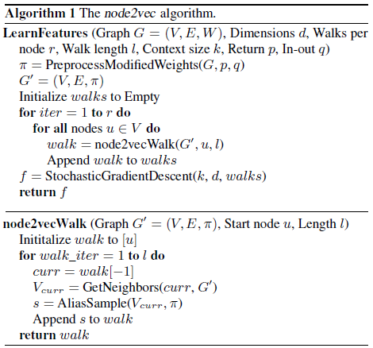

# [Node2Vec: Scalable Feature Learning for Networks (KDD 2016)](https://drive.google.com/file/d/1MU4TTtyOrMJIbDSqkfNgklnKUc-XxJuT/view?usp=drivesdk)

## Overview
- 对于DeepWalker的改进
- 通过调整随机游走权重的方法使graph embedding的结果在网络的同质性（homophily）和结构性（structural equivalence）中进行权衡权衡。
- 宽度优先搜索（BFS）
- 深度优先搜索（DFS）
- node2vec区别于deepwalk，主要是通过节点间的跳转概率。跳转概率是三阶关系，即考虑当前跳转节点，以及前一个节点 到下一个节点的“距离”，通过 **返回参数p** 和 **远离参数q** 控制游走的方向（返回还是继续向前）
- 

## References
- [Stanford Network Analysis Project (SNAP)](https://snap.stanford.edu/node2vec/)
- [【Graph Embedding】node2vec：算法原理，实现和应用](https://zhuanlan.zhihu.com/p/56542707)
- [ArXiv](https://arxiv.org/abs/1607.00653)
- [GitHub](https://github.com/aditya-grover/node2vec)