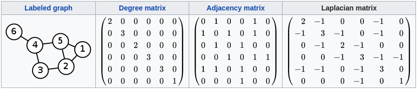

# [Semi-Supervised Classification with Graph Convolutional Networks (ICLR 2017)](https://drive.google.com/file/d/11CQO6ujGmwLMRgRh5sw68AAzh9auaD_B/view?usp=drivesdk)

## Overview
- 为什么要做傅里叶变换？
  - 卷积在傅里叶域的计算相对简单，所以文章在graph上做傅里叶变换（转换到频域），然后再计算卷积（矩阵相乘），最后再转变回空间域
- 什么是拉普拉斯矩阵？
  - **普通形式的拉普拉斯矩阵**: 
  - 拉普拉斯算子(Laplacian operator) 的物理意义是空间二阶导，准确定义是：标量梯度场中的散度，一般可用于描述物理量的流入流出。比如说在二维空间中的温度传播规律，一般可以用拉普拉斯算子来描述。
 
  - **对称归一化的拉普拉斯矩阵**（Symmetric normalized Laplacian）: 

- 为什么使用拉普拉斯矩阵？
  - 拉普拉斯矩阵是对称矩阵，可以进行特征分解（谱分解）
  - 特征分解（Eigendecomposition），又称谱分解（Spectral decomposition）是将矩阵分解为由其特征值和特征向量表示的矩阵之积的方法。只有对可对角化矩阵或有n个线性无关的特征向量的矩阵才可以施以特征分解。
  - 只有拉普拉斯矩阵是对称矩阵才可以写成特征矩阵的转置（而不需要计算逆矩阵）

- 传统傅里叶变换与图傅里叶变换的对照关系：

  |         | 传统傅里叶变换 | 图傅里叶变换  |
  | --- |:-------------:|:-----:|
  | 傅里叶变换基 |  |   |
  | 逆傅里叶变换基 |  |  |
  | 维度 |  | 节点个数n |
  
- 具体计算方式
  - f是Graph上的N维向量，可以表示某个点的特征向量，f(i)表示第i个特征
  - 内积形式 
  - 矩阵形式 

- 学习一阶laplace变换的参数，来求解节点的输出以及对相邻节点的扩散，好处在于只存在两个参数W0，W1，不管相邻节点有多少，都分享同样的W1
- 相当于是简化后一阶邻居的ChebNet

## Methods

- order spectral filer
  - 
  - 相当于只学习当前节点和直接相邻节点的参数
  - 如果在图像中的话3x3的filter只有3个参数
- Laplacian operator
  - 
- identity matrix
  - 
  - only focus on direct neighbors -> enforcing self-loops
- Normalization matrix D
  - 
- Weisfeiler-Lehman algorithm

## Drawbacks mentioned in other papers
- 卷积操作是通过计算图形拉普拉斯的特征分解在傅里叶域定义的 the convolution operation is defined in the Fourier domain by computing the eigendecomposition of the graph Laplacian
- 导致潜在的密集计算和非空间定位的过滤器 resulting in potentially intense computations and non-spatially localized filters.

## References

- [arXiv](https://arxiv.org/pdf/1609.02907.pdf)