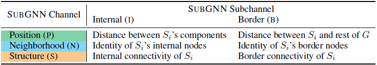
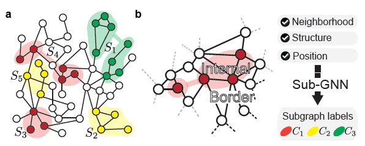
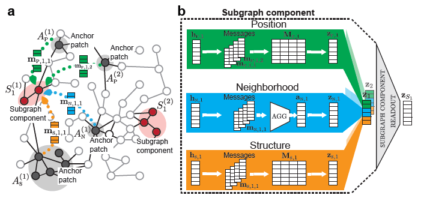

# [Subgraph Neural Networks (NIPS 2020)](https://drive.google.com/file/d/1JLxXYxboxKHQegfeSDrLiJf-fLU5t2ZJ/view?usp=drivesdk)

## Overview
- 目的是学习分解的子图表征 learn disentangled subgraph representations
- 子图提取和网络社区检测 Subgraph extraction and network community detection
- 子图间传递神经信息 propagates neural messages between the subgraph's components
- 从底层图中随机抽取的锚点补丁 randomly sampled anchor patches from the underlying graph

## Definitions
- 全图 
- 子图 ，并拥有一个标注 并可能含有相连的多个子图部件（components）
- 消息传播 MSG 
- AGG: 邻居  信息聚合函数  
- UPDATE: 将聚合的信息结合上一层的表征  并生成l层的表征 

## Method
- 子图间的消息传递架构 a neural message passing architecture  。它会生成一个  维的子图表达 
- SubGNN使用学到的子图表达  预测标注 
- 子图的6项重要属性

- **anchor patch**
  - 从全图中随机采样的子图集合 ，分为 position ，neighborhood ，structure 
  - 采样方程为 。
    - internal position sampling  随机在子图内部采样一个节点作为该子图的锚补丁。如果子图含有多个component，则使用整合的锚补丁集合代表整个子图 
    - border position sampling  随机采样多个节点 。**他们被所有子图共享**。
    - internal neighborhood sampler  从一个子图部件  内部随机采样多个节点 。
    - border neighborhood sampler  从子图部件  的k-hop邻居中 随机采样多个节点 。
    - structure sampler  被全网internal和border共享，获得两个锚补丁集合  和 。
  - 锚补丁编码 encoding
    - 和 直接映射节点嵌入
    - 返回的是一个结构的表征，方式是用w-定长 triangular random walks 生成一条路径。再用bi-LSTM学习一个隐藏状态作为该结构的表征。

- **子图表征学习**
  - 将神经消息从 锚补丁（anchor patch）传播到 子图部件（subgraph component）
  - 再聚合合成的表征到最后的子图嵌入 aggregating the resultant representations into a final subgraph embedding 
    - X 表示channel，为P, N, S之一
    -  为相似性方程 similarity function，用来计算 anchor patch 和 subgraph component的相似性。
      - P: shortest path (SP)
      - N: conditional constant
      - S: normalized dynamic time warping (DTW)
    -  为学习到的anchor patch表征
  - 获得聚合信息 

  - 结合聚合信息和本地隐藏表征，得到更新的表征 
  - **注意！** 所有这些都是对P, N, S三个channel分开做的。最后合起来 。用 聚合3个channel。用 聚合针对某个子图的所有layer的信息。

## References
- [ArXiv](https://arxiv.org/abs/2006.10538)