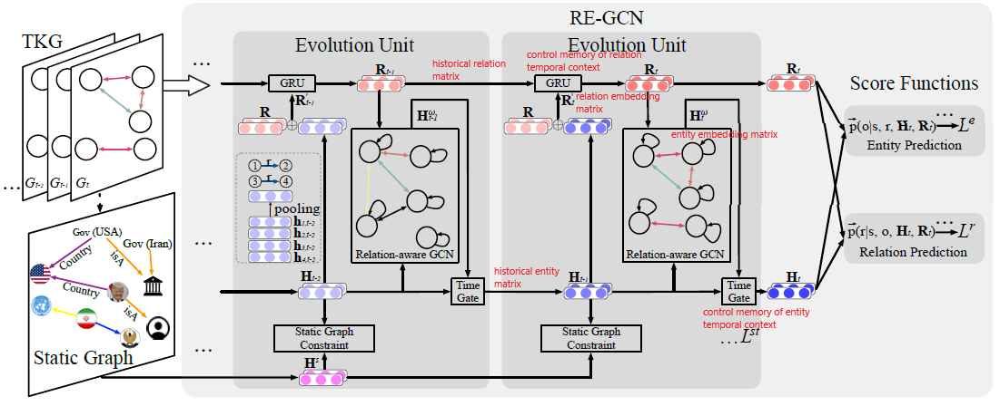

# [Temporal Knowledge Graph Reasoning Based on Evolutional Representation Learning (arXiv 2021)](https://drive.google.com/file/d/1HyhLYHrMjhJ7n9JtzXHSEv5dqdDFOjBX/view?usp=drivesdk)

## Concept
- Reasoning over Temporal Knowledge Graph (RTKG): predicts facts in the future
- Key: predict future facts is to thoroughly understand the historical 
- 通过循环的方式，逐渐学习实体和其关系的表达 Evolutional representations of entities and relations at each timestamp by modeling the KG sequence recurrently.
- Evolutional entity representations -> 图总结构不变，但是每个时间点出现的节点会不一样
  - model the occurrence of all facts in the history as a temporal
point process
    - [Know-evolve (ICML 2017)](https://arxiv.org/abs/1705.05742)
    - [DyRep (ICLR 2019)](https://openreview.net/forum?id=HyePrhR5KX)
  - extract related historical information for each individual query in a heuristic manner.
    - [RE-NET](https://arxiv.org/abs/1904.05530)
    - [CyGNet]()
- 两种RTKG设定：
  - 内插法（interpolation）：根据0~T内已知事实，推断期间丢失事实
  - 外推法（extrapolation）：根据0~T内已知事实，预测>T的未来事实
- 两种RTKG的子任务
  - Entity Prediction 实例预测：预测主语/宾语
  - Relation Prediction 关系预测：预测关系

## Overview
- 架构是一种 **基于GCN的循环进化网络 (RE-GCN)** Recurrent Evolution network based on Graph Convolution Network (GCN)
- 使用static graph constraint component以更好地获取实例表达
- 通过将TKG问题理解为KG序列，RE-GCN有效地对历史信息建模，并同时预测实例和关系

## Method

- 定义
  - TKG 被理解为一个时序图 
  - 每个时刻的 图 为 
  - 每个时刻会出现以下几种状况，表示为一个四元组 
    - 正向全知关系对 
    - 反向全知关系对 
    - 静态关系图（固定已知关系）
    - 主/宾语缺失  或 
    - 关系缺失 
- **进化单元** Evolution Unit
  - 结构：
    - one relation-aware GCN：学习每帧的结构关系
    - two gate recurrent components：对历史KG时序建模
      - time gate recurrent component: 学习实例表达
      - GRU component: 学习关系表达
    - one static graph constraint component：通过添加限制，将静态关系整合到进化嵌入中
  - 获取同时发生事实间结构依赖性 的两种方法：
    - 基于事实（facts）分析 实例之间的关联（associations among entities through facts)
    - 分析 共享实例的关系之间的关联（associations among relations through the shared entities）
  - 具体实现
    - 主语实例o在GCN的l层获取来自宾语实例的信息，通过以下公式 
    -  是 object节点的嵌入特征， 为激活函数， 为聚合矩阵， 为自循环矩阵
    - time gate 控制多少当前 最后一层GCN图实例特征  和历史特征会影响 实例嵌入矩阵    
    
    - **关系嵌入**  **是通过 拼接 与当前relation 相关的节点（fact）特征 得到的** 。如果针对一个relation 没有相关节点，那么关联向量就是零向量。
    - GRU gate 控制多少当前 relation特征 受历史relation特征 影响
    - static KG起到输入背景知识的作用，对模型学习更准确的进化性实例表达用处很大。该静态图需要预训练，为一层R-GCN（无自循环关联）网络构成。更新方程为   
    - 通过计算evolutional embedding和static embedding之间的cosine  来反应学习到的实例embedding matrices和静态特征间的区别。惩罚目标函数项为 

 

## Dataset
- [ICEWS (Integrated Crisis Early Warning System)](https://github.com/andybega/icews)
  - ICEWS18
  - ICEWS14
  - ICEWS05-15
- [WIKIDATA](https://www.wikidata.org/wiki/Wikidata:Main_Page)
- [YAGO High-Quality Knowledge Base](https://www.mpi-inf.mpg.de/departments/databases-and-information-systems/research/yago-naga/yago) held by Max Plank Institute
- [GDELT (Global Database of Events, Language, and Tone)](https://www.gdeltproject.org/data.html#rawdatafiles)

## References
- Current Papers
  - [ArXiv](https://arxiv.org/abs/2104.10353)
  - [GitHub](https://github.com/Lee-zix/RE-GCN)
  - [IJCAI](https://www.ijcai.org/Proceedings/2020/0386.pdf)