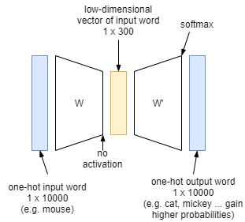

# [Efficient Estimation of Word Representations in Vector Space (word2vec, arXiv 2013)](https://drive.google.com/file/d/1PKKf87XdUvikcjO-Wi64d8ntMMjQOGHu/view?usp=drivesdk)

## Purposes
- 计算单词的连续向量表达
- 词表达的相似性要高于简单的句语法规律（线性规律）：King-Man+Woman=Queen。
- 专注于基于神经网路的模型（distributed representations of words）

## Concept
- 架构为一个全连网络，输入维度为vocabulary大小
- skip-gram with negative sampling，简称SGNS。**在给出目标单词（中心单词）的情况下，预测它的上下文单词（除中心单词外窗口内的其他单词，这里的窗口大小是2，也就是左右各两个单词）。**

- **单词矩阵**（word matrix）
  - 目标单词的词向量组成的矩阵，用 W 表示 (d x V)。d表示单个词向量的维度（图里用N表示），V表示词汇量
  - 除目标单词外的其他单词的词向量的转置组成的矩阵 用 W' 表示 (V x d)
- **单词相似度**
  - 内积
  - softmax函数

## Definition
- 目标单词的one-hot向量 
- 目标单词的词向量（需要求得的值） 
- 除目标单词外第x个单词的词向量 
- 图中， 表示输入one-hot向量，h表示目标词向量，y表示相似度 = 条件概率（给定时，出现的概率）

## Details
- 隐层没有使用任何激活函数，但是输出层使用了sotfmax
- 基于成对的单词来对神经网络进行训练，训练样本是 ( input word, output word ) 这样的单词对，input word和output word都是one-hot编码的向量。最终模型的输出是一个概率分布。

## Training Strategy
- 将常见的单词组合（word pairs）或者词组作为单个"words"来处理，如New York，United Stated ...
- 对高频次单词进行抽样来减少训练样本的个数，如减少对"the","a"的训练。词概率公式：
  - 词原始出现概率 
  - 词保留概率 
- 对优化目标采用"**negative sampling**"方法，**每个训练样本的训练只会更新一小部分的模型权重**，从而降低计算负担。
  - 如，我们期望在输出层对应"quick"单词的那个神经元结点输出1，其余9999个都应该输出0。在这里，这9999个我们期望输出为0的神经元结点所对应的单词我们称为"negative" word。
  - 当使用负采样时，我们将随机选择一小部分的negative words（比如选5个negative words）来更新对应的权重。

## References
- [Learning Word Embedding](https://lilianweng.github.io/lil-log/2017/10/15/learning-word-embedding.html)
- [理解 Word2Vec 之 Skip-Gram 模型](https://zhuanlan.zhihu.com/p/27234078)
- [Word2Vec Tensorflow](https://www.tensorflow.org/tutorials/text/word2vec)
- [[NLP] 秒懂词向量Word2vec的本质](https://zhuanlan.zhihu.com/p/26306795)