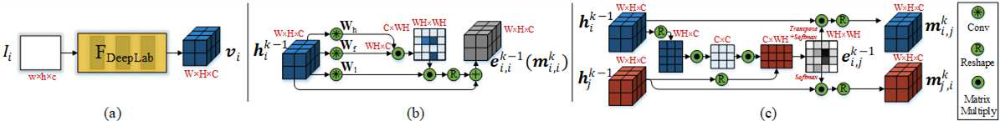
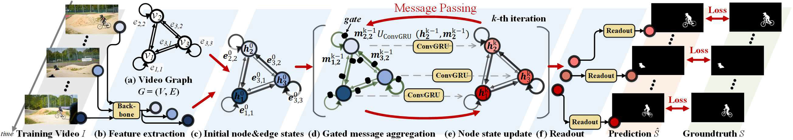

# [Zero-shot Video Object Segmentation via Attentive Graph Neural Networks (ICCV 2019)](https://drive.google.com/file/d/1m6cfm2M_dPQLvrRDL4XyoAWQwwLP0Ou5/view?usp=drivesdk)

## Overview
- AGNN builds a fully connected graph to efficiently represent frames as nodes, and relations between arbitrary frame pairs as edges. 每一帧作为一个节点，用一个全连图表达一对帧的关联，**最后每个节点再输出一个分割图**
- 避免了对每一帧计算光流估计
- AGNN has a desirable, spatial information preserving property -> 允许完成像素级预测任务
- 节点间的关系用differentiable attention mechanism表示
- parametric message passing

## Concept & Keyword
- IOCS (Image Object Co-Segmentation): aims to jointly segment common objects belonging to the same semantic class in a given set of related images 配对相关帧间的对象

## Method

- 基本的图神经网络架构：对每个节点，通过聚集其邻接节点的表达，更新一个隐藏表达h_i，在根据h_i产生该节点的输出o_i
  - parametric message passing phase：运行K步，逐渐将消息传递，并更新节点表达。在每步，对每个节点v_i，根据所受到的消息和其之前的状态h，使用 消息处理函数M和状态更新函数U 预测当前的汇总消息m和状态h。
  - readout phase：在最后一步（K步），对h处理输出o

- preserve spatial features
  - 使用DeepLabV3的前5层卷积模块 预测出特征图（直接是WxHxC大小的feature map），并当作节点表达

- capture pair-wise relations (edges) via a differentiable attention mechanism
  - Intra-Attention Based Loop-Edge Embedding：连接自身节点的循环边，用来学习帧内部的关联 [[reference1](https://arxiv.org/abs/1706.03762), [reference2](https://arxiv.org/abs/1711.07971)]
  - Inter-Attention Based Line-Edge Embedding：连接不同节点的线性边，学习帧间的关联 [[reference](https://arxiv.org/abs/1606.00061)]
  - learnable weight matrix  是用来根据节点状态向量  和  计算出来 边向量 
  - Gated Message Aggregation：
    - 将上个时刻loop-edge作为当前节点的消息 
    - 从临近节点传过来的消息 被定义为  (softmax对每行做归一化)
    - 额外还定义了一个leanable gate network G，用来过滤噪音或相机偏移等有害节点 
    - 节点i最终的消息是所有经过gate加权后的求和 
    - 使用ConvGRU [[ref](https://arxiv.org/abs/1511.06432)] 算出当前时刻状态向量 
    - K轮消息传递后，得到最终的每个节点的特征向量，并预测出最终图像分割的结果 

## Dataset
- [DAVIS](https://davischallenge.org/)
- [Youtube-Objects](https://data.vision.ee.ethz.ch/cvl/youtube-objects/)
- [PASCAL VOC](http://host.robots.ox.ac.uk/pascal/VOC/)

## References
- [ICCV Paper](https://openaccess.thecvf.com/content_ICCV_2019/papers/Wang_Zero-Shot_Video_Object_Segmentation_via_Attentive_Graph_Neural_Networks_ICCV_2019_paper.pdf)
- [Github](https://github.com/carrierlxk/AGNN)