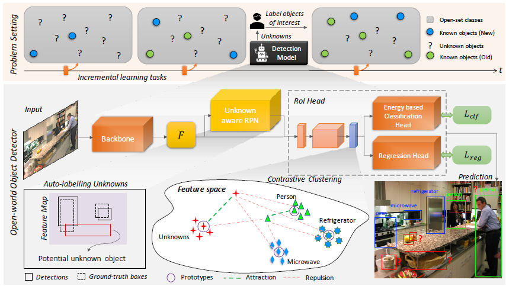
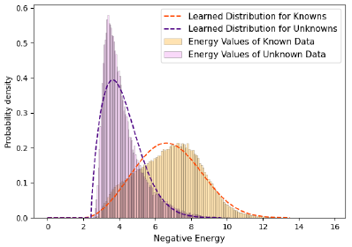

# [ORE: Towards Open World Object Detection (CVPR 2021)](https://drive.google.com/file/d/16yykuhdUoCc6KcS430g5YwRQ1wF2mL0A/view?usp=drivesdk)

## Target
- 识别未知对象 identify objects that have not been introduced to it as 'unknown'
- 持续学习未知类别，并不忘记之前学到的类 incrementally learn these identified unknown categories without forgetting previously learned classes

## Proposal
- 基于Region Proposal Network提出了一种自动标注机制，通过标注未知类来帮助训练 基于能量的分类头 (energy-based classification head) 来分清已知和未知实例

### **对比性聚类法 (contrastive clustering)**
- 缩进同类实例，推离不同类实例。为每个类 i 的cluster维护一个prototype vector  

    , where 
    
- 由此得到一个prototype set ，该prototype需要gradually evolve以实现端到端训练。
- 为了计算prototype，对每个类需要保存固定长度为Q的queue（一个类中随机抽样样本）。因此需要一个 大小的矩阵  用来计算prototypes

### **自动标注未知样本的RPN Auto-labelling Unknowns with RPN**
- RPN只标注objectness score较高的部分
- 将不与GT物体重合的proposal标注为unknown object

### **基于能源的未知识别器 Energy Based Unknown Identifier**
目的：
- 估计 观察到的变量 F 与 可能的输出变量集 L 之间的兼容性
- 最后 已知 和 未知数据的能量值必须被明显分离

训练是最小化能量方程, T为常数（temperature parameter） 

放在网络里，为分类头 

## References
- [arxiv](https://arxiv.org/pdf/2103.02603.pdf)
- [zhihu](https://zhuanlan.zhihu.com/p/386046811)
- [github](https://github.com/JosephKJ/OWOD)