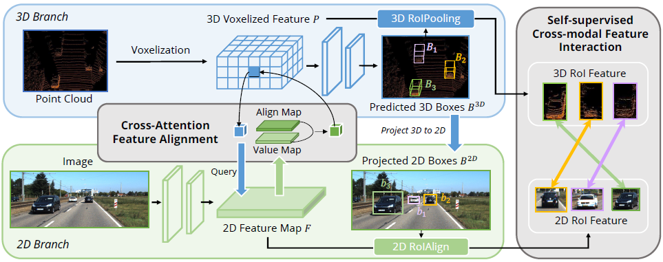

# [AutoAlign 2022: Pixel-Instance Feature Aggregation for Multi-Modal 3D Object Detection](https://drive.google.com/file/d/1D-LM7nr0w2YkMVUVlXV1ZHr-Nh5bI6lP/view?usp=drivesdk)

## Idea
- 不需要摄像机投射矩阵（camera projection matrix），而是使用 注意力机制 (attention mechanism) 会自动学习映射关系（learnable alignment map）
- 使用 自监督跨模态特征互动模块 self-supervised cross-modal feature interaction module

## Proposal
- ResNet-50提取图像特征，输出大小为 
- backbone最后输出 ，flatten后变成2D特征向量 
- 从点云中voxelization，得到voxel特征 P
- **Cross-Attention Feature Alignment (CAFA) module**
    - 从图像特征F中获取 key  和 value ，在点云特征 P 中获取 queries , 求点积，归一化后得到注意力矩阵

        , 

        
    - 经过前馈网络得到预测 
- **Self-supervised Cross-modal Feature Interaction (SCFI)**
    - 随机选取N个3D检测框 ，并投射到2D平面上，得到 
    - 根据这N个Boxes，通过2DROIAlign和3DRoIPooling获取Boxes中的特征 
     
    
    - 对图像和点云特征 做 相同的投影 , 点云还要额外做预测 :  
    - 通过对称损失函数来比较特征距离 

## References
- [arxiv](https://arxiv.org/pdf/2201.06493.pdf)
