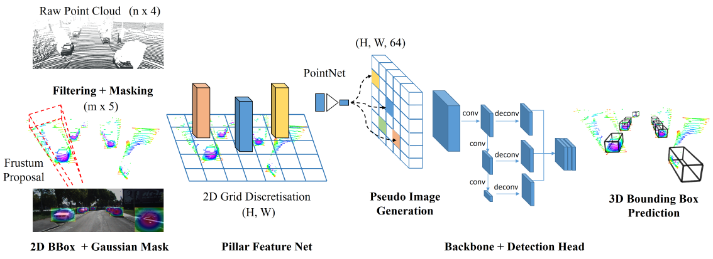

# [Frustum-PointPillars 2021: A Multi-Stage Approach for 3D Object Detection using RGB Camera and LiDAR](https://drive.google.com/file/d/1UK8AvxnlZ85M0bK2cVIZHheMwNaKgWRI/view?usp=drivesdk)

## Idea
- leverage the mature field of 2D object detection to reduce the
search space in the 3D space 使用2D对象检测获取frustum，来减少3D空间的搜索范围
- 在搜索道德3D矩形视界中使用PointNet，获取柱形特征pillar features，用2D卷积获取空间特征
- 运行帧率超过 14 Hz
- 除了2D对象检测, F-PointPillars是端到端训练

## 传感器融合的解决方案
- Early fusion 早期融合：将多传感器特征串联，投射，或使用小型网络融合
- Late fusion 晚期融合：传感器各自有一个网络并行计算，最后对预测结果进行融合
- Multi-stage methods 多阶段方法：串联式，一个传感器的输出构成（constitute）下个传感器的输入

## Proposal

- Frustum proposal
    - 使用相机投射矩阵从2D BBox获取frustum (锥台)
- PointCloud masking
    - 在2D BBox中的对象由前景和后景点阵构成，这些点阵并不能很好区分开
    - 使用概率蒙版（probability mask）来解决问题，蒙版以高斯核来生成概率 ，靠近中心的点阵更可能属于检测对象
    - 将概率加入点云的特征向量中，形成 
- Pillar feature encoding network
    - 对于剩下的点云，在Bird-Eye-View上划分2D栅格 
    - 对每个非空栅格，重采样N个点
    - 对每个点再加入相对中心点位置距离特征 ，其中  为中心点坐标， 为相对中心点俯视图距离
    - 对每个cell的N个点使用PointNet，并得到一个特征向量 
    - 最后每个点都有10维的特征，形成一个2D俯视图 
- Backbone to process the pseudo-image and produce a high-level representation
    - 对2D俯视图使用2D检测，获取俯视图的2D BBox

## References
- [IEEE ICCV](https://ieeexplore.ieee.org/document/9607424)
- [Frustum-PointPillars (github)](https://github.com/anshulpaigwar/Frustum-Pointpillars)