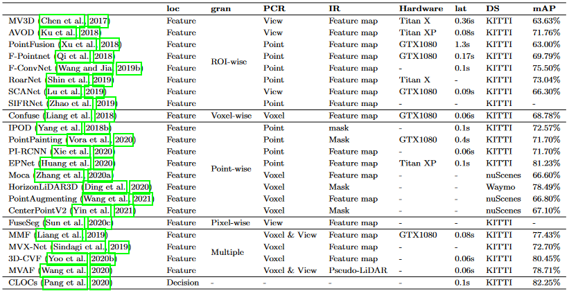

# Point Cloud

## Coordinate System
- cartesian coordinates (x, y, z)
- Spherical coordinates
  - θ: elevation angle, the angle with respect to the positive direction of the z axis
  - ϕ: azimuth angle, the angle in x-y plane with respect to the positive direction of the x axis
  - r: distance of the point from the origin

## Data Format
- Each point cloud is an unordered set of returned lidar points. 
- Each returned lidar point is a 4-tuple formed by its coordinate with respect to the lidar coordinate frame as well as its intensity ρ.
- In the KITTI dataset, ρ is a normalized value between 0 and 1, and it depends on the characteristics of the surface the lidar beam reflecting from.

## Solutions
- convert point clouds into 2D images by view projection 3D映射到2D图片 [link](https://arxiv.org/abs/1611.07759)
  - 丢失重要3D信息
- structure volumes of voxel grids through quantization 将空间分成voxel栅格 [link](https://arxiv.org/abs/1604.03265)
  - 丢失重要3D信息

## Survey

- [3D-PointCloud (github): Paper list and Datasets about Point Cloud](https://github.com/zhulf0804/3D-PointCloud)
- [MMDetection3D](https://github.com/open-mmlab/mmdetection3d)
- [OpenPCDet (github)](https://github.com/open-mmlab/OpenPCDet)
- [Lidar 3d Object Detection Methods 2020](https://towardsdatascience.com/lidar-3d-object-detection-methods-f34cf3227aea)
- [Deep Learning for Image and Point Cloud Fusion in Autonomous Driving: A Review 2020](https://arxiv.org/abs/2004.05224)
- [LiDAR-Camera Fusion for 3D Object Detection 2020](https://drive.google.com/file/d/1N8jLEsPXjh5d4gvOITOUc3lft-jqgqpp/view?usp=drivesdk)
- [Multi-Modal 3D Object Detection in Autonomous Driving: a Survey](https://arxiv.org/pdf/2106.12735.pdf)