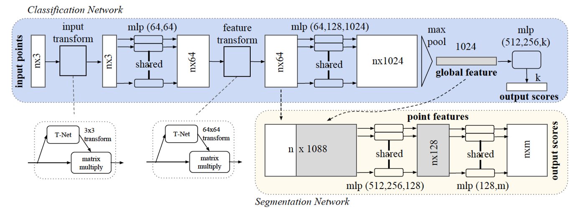

# [PointNet 2017](https://drive.google.com/file/d/1IVFZKupC8Q8zB8e7ogxJt0OPzn8IN4I_/view?usp=drivesdk)

- Input is randomly ordered point list.
- Classification network
    - extract point features
    - max pooling gets global feature
- Segmentation network
    - point feature + global feature
    - output: segmentation mask map

## References
- [arxiv](https://arxiv.org/abs/1612.00593)