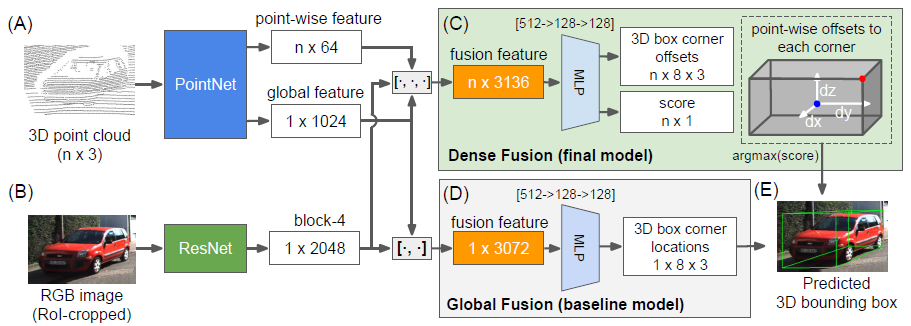

# [PointFusion: Deep Sensor Fusion for 3D Bounding Box Estimation](https://drive.google.com/file/d/10-U3kjtVdwk_dJMm5za3GkSHM9xdlN2x/view?usp=drivesdk)

## Idea
- 图像和点云分别处理
- 最后使用fusion network合并图像和点云特征，使用了两种网络架构
    - 全局融合架构 a global fusion architecture
    - 密集融合网络 dense fusion network

**全局融合架构**

使用bbox的全局坐标  作为回归目标 

**密集融合网络**

以3D点云作为dense spatial anchors，对每个点预测 其相对box的角坐标的spatial offset。以此应对从1m到100m大范围对象的坐标回归。 

## Dataset
- [SUN-RGBD](https://rgbd.cs.princeton.edu/)

## References
- [CVPR](https://openaccess.thecvf.com/content_cvpr_2018/papers/Xu_PointFusion_Deep_Sensor_CVPR_2018_paper.pdf)
- [GitHub](https://github.com/mialbro/PointFusion)