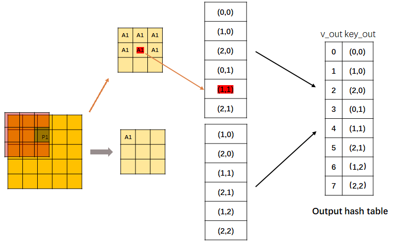
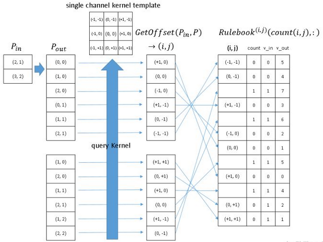
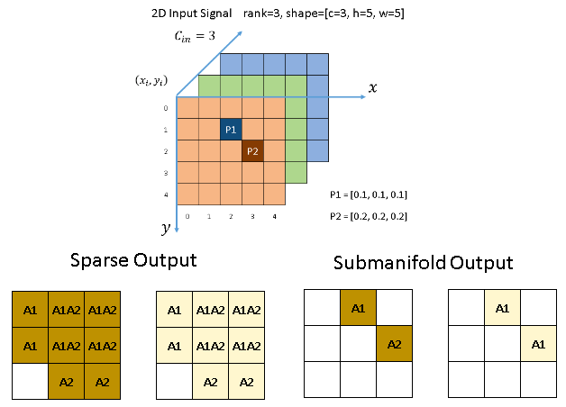
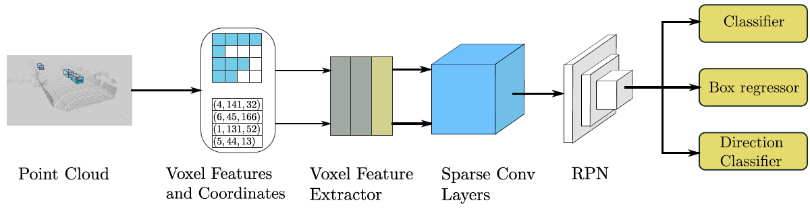

# [Second 2018: Sparsely Embedded Convolutional Detection](https://drive.google.com/file/d/1dmyYcYAahDp24RGvUfpvfoNkxJvSm7Mv/view?usp=drivesdk)

## Idea
- 基于voxel的3D卷积网络速度过慢 Voxel Voxel-based 3D convolutional networks has slow inference speed and low orientation estimation performance
- 提出一种 稀疏卷积网络（sparse convolution method）
- 提出一种基于角度损失回归的算法以提升 方位估计性能（orientation estimation performance）
- 提出了一种新的数据加强方法（data augmentation approach）
- 帧率 20-40fps （0.025s in GTX 1080Ti)，通常激光雷达的扫描频率为10 Hz

## 稀疏卷积原理
- 将稀疏的输入特征通过gather操作获得密集的gather特征
- 使用GEMM（general matrix multiplication）对密集的gather特征进行卷积操作，获得密集的输出特征
- 通过预先构建的输入-输出索引规则矩阵，将密集的输出特征映射到稀疏的输出特征

具体流程是
- 卷积的输入为一个矩阵M和一个哈希表H
    - 矩阵M为输入feature map上不为空的部分的特征，大小为 ， a代表不为空的位置个数，n代表特征维度
    - 哈希表H，key代表输入中不为空的位置的坐标，value代表这个坐标对应的特征是M中的哪一行特征
- CPU上，对H中的key进行遍历，确定卷积输出feature map上不为空的位置的坐标与个数，组成 
- 确定rule book， rule book的每一行对应计算卷积输出feature map上不为空的某个位置所需要输入feature map上的位置，通过这个位置得到输入哈希表中该位置对应的key，填充到rule book中
- GPU上，对rule book的每一行进行并行计算，得到每个不为空的输出位置的输出
- **通过哈希表H，就可以避免重叠区域的重复计算**
- **GEMM本质上是卷积的一种变形，只是表达方式上用offset的概念替代了卷积操作，以使得在hash table上实现卷积**
 

## 子流形稀疏卷积原理 (submanifold convolution)
- submanifold指稀疏卷积指输出feature map上不为空的位置与输入feature map上不为空的位置相同
- 稀疏卷积会使得数据的稀疏性指数下降，而submanifold会保持一样的稀疏性，但是如果只用submanifold稀疏卷积，卷积核的感受野会限制在一定范围内

## 常规稀疏卷积 vs 子流形稀疏卷积
- 常规稀疏卷积: 像普通的卷积一样，只要kernel 覆盖一个active input site，就可以计算出output site
- 子流形稀疏卷积: 只有当kernel的**中心**覆盖一个active input site时，卷积输出才会被计算

## Proposal

- 在架构上与VoxelNet的区别主要在于使用了 稀疏卷积层 （sparse convolution layer）
- Region Proposal Network 使用了类似SSD的结构，输出 类别，offset 和 方向
- Loss
    - Sine-Error Loss for **Angle Regression** 
        
    - Focal Loss for Classification
- 数据增强 Data Augmentation
- 随机使用GT到训练中（teaching mode）
- 对**每个点**各自随机变换（随机旋转，随机线性变换），以提高对抗噪音的能力
- 全域随机旋转缩放

## References
- [MDPI Paper](https://www.mdpi.com/1424-8220/18/10/3337)
- [MMDetection 3D](https://github.com/open-mmlab/mmdetection3d)
- [Second.PyTorch](https://github.com/traveller59/second.pytorch)
- [通俗易懂的解释Sparse Convolution过程](https://zhuanlan.zhihu.com/p/382365889)
- [【3D目标检测】SECOND算法解析](https://zhuanlan.zhihu.com/p/356892010)