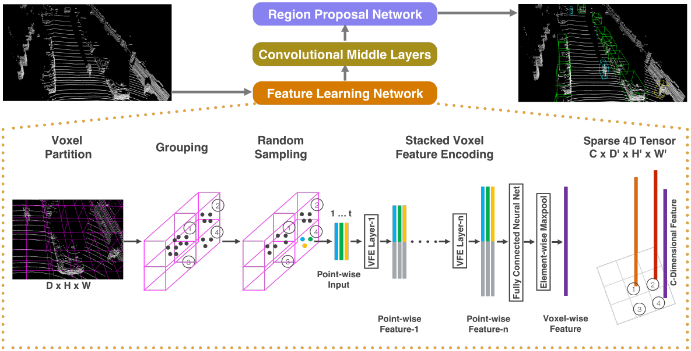
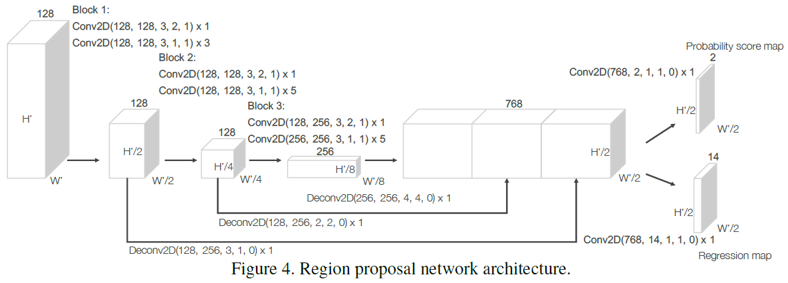

# [VoxelNet 2018: End-to-end learning for point cloud-based 3D object detection](https://drive.google.com/file/d/1nuP6PCAb5isLO6P-IDceH5rFt3FbD0Tu/view?usp=drivesdk)

## Proposal
- 规定一个固定的3D范围：D, H, W
- 分成大小相同的voxel，voxel大小为固定的 , , 
- 将每个voxel中所有点收集起来，成为一个长度为T的点集。如果voxel中含的点超过T，则只随机选取（random sampling）其中T个。
  - 
  - r是反射率

- 对voxel特征加密（Voxel Feature Encoding）
  - 计算voxel的中心点 
  - 进而得到强化的voxel特征 ，相当于加入了局部位置信息

- 通过全连层 (FCN+BN+ReLU) 得到voxel特征 
- Element-wise Maxpooling 后得到 locally aggregated feature 
- 将 laf  与  合并为 （类似于Residual Connection）
- 为了避免处理sparse voxel，使用Sparse Tensor Representation输出一个只含非空的voxel的列表

- 对voxel特征使用3D卷积 

- 最后使用Region Proposal Network从3D卷积层输出的特征中预测3D BBox或分类。输出是 

## Efficient Implementation
- 初始化一个大小为 的tensor作为输入特征缓存（input feature buffer）
  - K: 最大非空voxel数
  - T: voxel中最大点数
  - 7: 原始输入特征的维度
- 随机对voxel中点进行处理，使用基于hash key检查是否随机选取的点已被处理

## References
- [LiDAR point-cloud based 3D object detection implementation with colab {Part-1 of 2} 2020](https://towardsdatascience.com/lidar-point-cloud-based-3d-object-detection-implementation-with-colab-part-1-of-2-e3999ea8fdd4)
- [arxiv](https://arxiv.org/pdf/1711.06396.pdf)